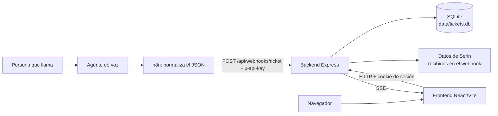
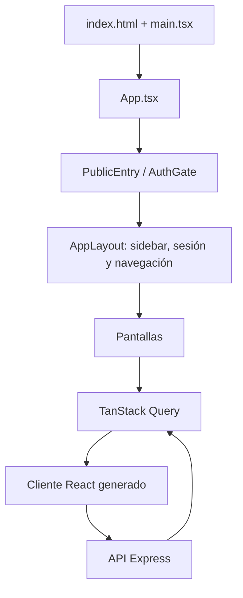
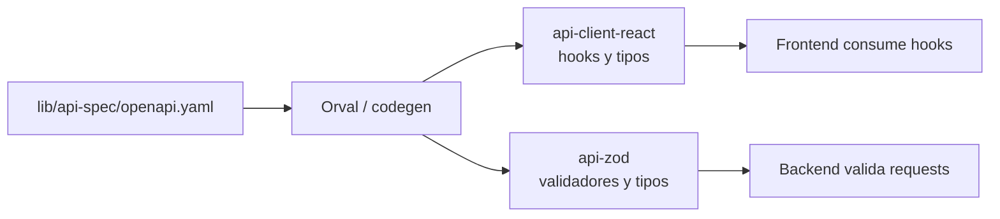
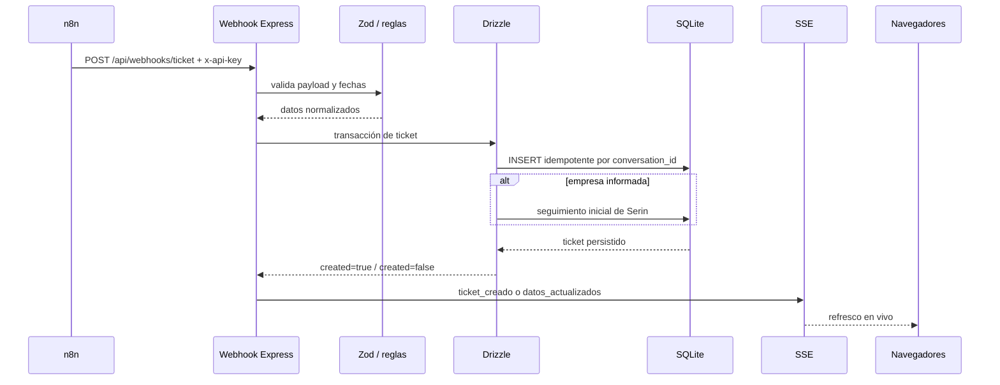
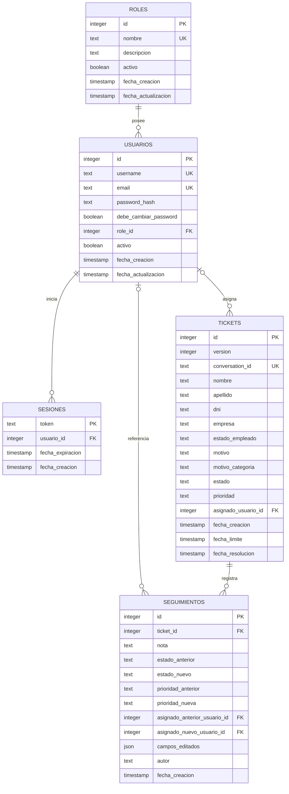
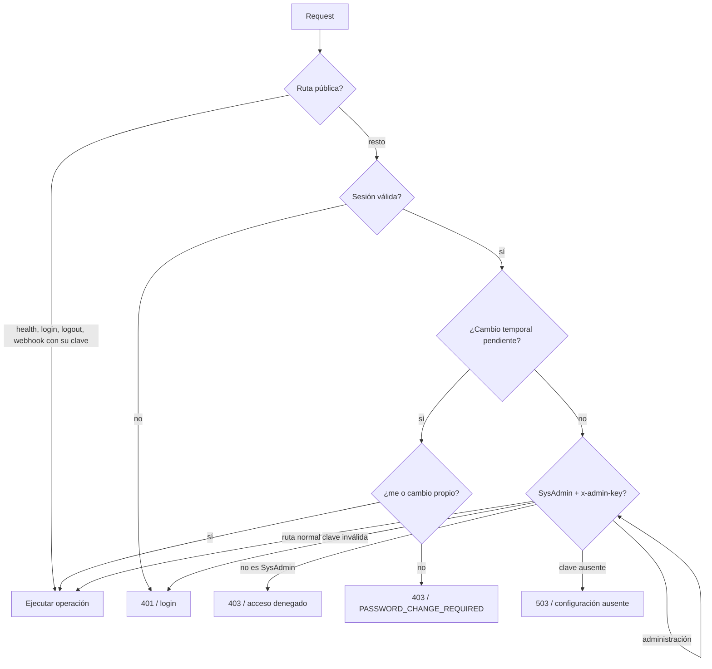
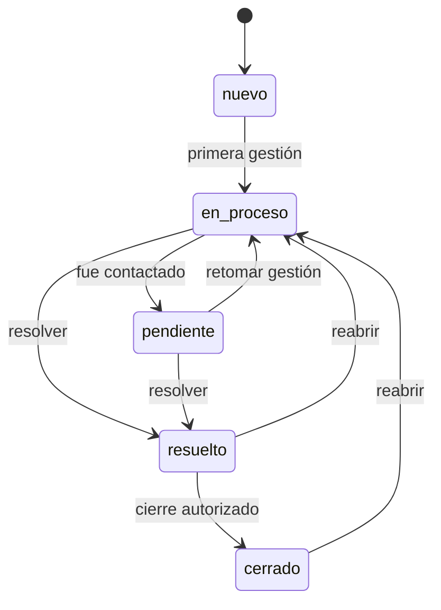
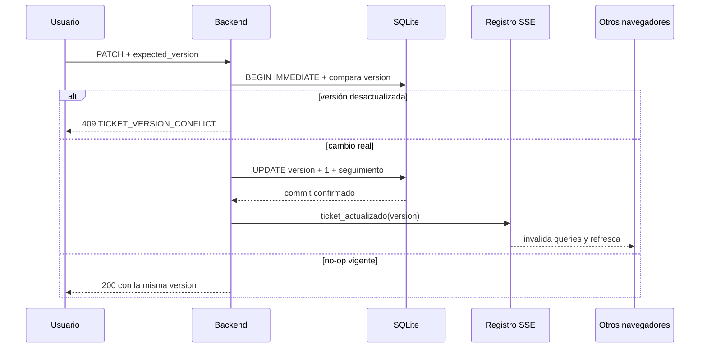
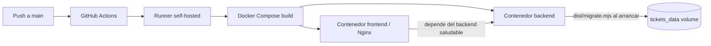

# Arquitectura de GSB Tickets

## 1. Resumen ejecutivo

GSB Tickets es una aplicación web fullstack para recibir llamados telefónicos, convertirlos en tickets y gestionar su resolución con trazabilidad.

La arquitectura elegida es un **monolito modular fullstack**:

- **Frontend SPA:** React + Vite, servido por Nginx en producción.
- **Backend HTTP:** Node.js + Express, con una API REST bajo `/api`.
- **Persistencia:** SQLite en modo WAL. El acceso operativo usa Drizzle ORM; el backup verificado usa directamente el driver `better-sqlite3`.
- **Paquetes compartidos:** contrato OpenAPI, clientes generados, validadores Zod y lógica de ingesta/SLA.
- **Actualización en vivo:** Server-Sent Events (SSE), sin un broker externo.
- **Despliegue:** Docker Compose ejecutado por GitHub Actions sobre un runner self-hosted.

No es una arquitectura de microservicios. El sistema se despliega como una unidad operativa —frontend, backend y una base SQLite persistente— porque el volumen, el contexto y la operación actual no justifican la complejidad de separar servicios o administrar un servidor de base de datos independiente.



## 2. Estilo arquitectónico

### Monolito modular

El repositorio contiene varios paquetes, pero la aplicación se ejecuta como dos procesos principales:

1. El frontend, responsable de la experiencia de usuario.
2. El backend, responsable de autenticación, reglas de negocio y persistencia.

Los paquetes de `lib/` son módulos reutilizables dentro del mismo workspace; no son servicios independientes. Esta separación permite mantener límites claros sin introducir llamadas de red entre módulos internos.

### Capas del backend

El backend tiene una separación por responsabilidades **parcial y en evolución**. Las reglas reutilizables ya están extraídas, pero varios handlers todavía combinan transporte HTTP, consultas y coordinación transaccional. El diagrama representa las dependencias actuales, no una separación ideal ya terminada:

```mermaid
flowchart TB
    http[HTTP / Express]
    routes[Rutas y middlewares<br/>backend/src/routes]
    app[Servicios y reglas extraídas<br/>SLA, prioridad, clasificación, visibilidad]
    shared[Paquetes compartidos<br/>@workspace/ingesta<br/>@workspace/api-zod<br/>@workspace/password-policy]
    persistence[Persistencia<br/>@workspace/db + Drizzle]
    sqlite[(SQLite)]

    http --> routes
    routes --> app
    routes --> persistence
    app --> shared
    app --> persistence
    persistence --> sqlite
```

#### Transporte y seguridad

`backend/src/index.ts` carga el entorno y valida los secretos entre servicios antes del seed y antes de abrir el puerto; una configuración incompleta no puede reportarse saludable. `backend/src/app.ts` desactiva la firma `X-Powered-By` y configura logging HTTP, cookies y parseo del body. No se emiten headers CORS: React consume `/api` desde el mismo origen mediante Vite/Nginx y n8n llama al webhook como servidor-a-servidor. En producción, Nginx oculta su versión y la firma defensiva de Express, impide MIME sniffing y framing, limita el referrer cross-origin y deshabilita capacidades del navegador que la aplicación no usa. Estas cabeceras se declaran en `server`, con `always`, para cubrir SPA, API, SSE y respuestas de error. `backend/src/routes/index.ts` monta las rutas bajo `/api` en este orden:

1. `health`: health check público.
2. `webhooks`: ingesta pública protegida por `x-api-key`.
3. `auth`: login y logout idempotente son públicos; sesión actual y cambio propio validan la cookie dentro del router.
4. `requireSession`: candado global para el resto de la API.
5. Tickets, dashboard, administración y SSE.

La API valida entrada con schemas generados desde OpenAPI/Zod. Las operaciones de administración suman una segunda verificación: rol `SysAdmin` y `x-admin-key`.

#### Reglas de negocio

Las reglas importantes viven fuera de los handlers cuando pueden reutilizarse:

- `lib/ingesta/src/motivos.ts`: clasificación estable del motivo.
- `lib/ingesta/src/sla.ts`: 48 horas hábiles, pausando sábados y domingos.
- `lib/password-policy`: política única de credenciales nuevas para servidor y UI.
- `backend/src/lib/prioridad-automatica.ts`: promoción de prioridad a `alta`/`urgente`.
- `backend/src/lib/prioridad-automatica-runner.ts`: ejecución al arranque y periódica.
- `backend/src/lib/ticket-query.ts`: filtros y orden server-side.
- `backend/src/lib/reclasificar-motivos.ts`: reconciliación conservadora de Embargos.
- `lib/db/src/ticket-visibility.ts`: regla compartida para cuarentena de registros vacíos.

#### Persistencia

`lib/db` crea una única conexión SQLite con:

- modo `WAL`, para mejorar concurrencia entre lecturas y escrituras;
- `foreign_keys = ON`, para respetar cascadas y restricciones;
- Drizzle ORM como acceso tipado de la aplicación;
- migraciones ejecutadas por el migrador de Drizzle en producción.

La excepción deliberada es el backup online: usa la API nativa de `better-sqlite3` para copiar una base en WAL y ejecutar `PRAGMA integrity_check` antes de publicar el archivo resultante.

El backend es intencionalmente de instancia única respecto del archivo SQLite. Escalar horizontalmente varios contenedores contra el mismo archivo no forma parte del diseño actual.

### Frontend SPA

El frontend usa React, Wouter y TanStack Query:



`AuthGate` evita renderizar pantallas protegidas sin una sesión válida. La raíz (`/`) es la entrada del login; cuando existe sesión, redirige a `/dashboard`.

Las pantallas principales son:

- `/dashboard`: KPIs, estados, prioridades, motivos y actividad.
- `/tickets`: listado filtrable, paginado, ordenable y exportable.
- `/tickets/:id`: detalle, edición, audio y seguimiento.
- `/admin`: CRUD, importación, cuarentena y zona peligrosa.
- `/admin/roles-usuarios`: gestión de usuarios y roles para SysAdmin.

El estado remoto se invalida después de mutaciones y también por eventos SSE. Los errores de sesión (`401`) vuelven a la entrada; los errores de servidor muestran una pantalla recuperable.

## 3. Contrato y paquetes compartidos

El flujo es **contract-first**:



La fuente editable es `lib/api-spec/openapi.yaml`. Los archivos en `lib/api-client-react/src/generated/` y `lib/api-zod/src/generated/` son artefactos derivados: no deben editarse manualmente.

El comando oficial para regenerarlos es:

```text
pnpm run codegen
```

Otros paquetes compartidos:

| Paquete | Responsabilidad |
|---|---|
| `@workspace/db` | Schema Drizzle, conexión SQLite, migraciones y visibilidad de tickets |
| `@workspace/ingesta` | Motivos, categorías, SLA, prioridad y origen Serin |
| `@workspace/api-spec` | OpenAPI y configuración de Orval |
| `@workspace/api-client-react` | Hooks React Query y tipos de consumo |
| `@workspace/api-zod` | Schemas Zod consumidos por el backend |
| `@workspace/password-policy` | Límites y reglas puras de contraseñas nuevas compartidas por backend/frontend |
| `@workspace/scripts` | Importador histórico y backup de SQLite |

## 4. Flujo de una llamada



El webhook es idempotente: un reintento con el mismo `conversation_id` devuelve el ticket existente y no duplica el seguimiento inicial de Serin.

## 5. Modelo de datos

La base contiene cinco tablas principales. Las fechas se almacenan como timestamp Unix en milisegundos; Drizzle las expone como `Date`.



### `tickets`

Es la entidad operativa principal:

- `conversation_id` es único y funciona como clave de idempotencia de n8n.
- `version` comienza en 1, no admite cero o negativos y avanza con cada modificación real de la fila. Es metadato interno de concurrencia: no se importa ni exporta como dato de negocio.
- `motivo` y `resumen` conservan el texto recibido.
- `motivo_categoria` es una columna derivada; actualmente incluye `embargos`, `legales` y categorías operativas generales.
- `estado_empleado` admite `Activo` o `Inactivo` cuando existe una empresa asociada y proviene del dato recibido desde Serin.
- `estado` sigue el flujo `nuevo → en_proceso → pendiente → resuelto → cerrado`.
- `prioridad` admite `baja`, `media`, `alta` y `urgente`; el runner puede promoverla, pero nunca degradarla automáticamente.
- `asignado_usuario_id` es la identidad autoritativa. `asignado_a` conserva un snapshot legible y compatibilidad con datos históricos.
- `fecha_limite` representa el vencimiento SLA; `fecha_resolucion` se completa al resolver/cerrar y se limpia al reabrir.

Los registros completamente vacíos permanecen almacenados para auditoría, pero se excluyen de Tickets y Dashboard mediante una condición AND. SysAdmin puede abrirlos desde Administración.

### `seguimientos`

Es la auditoría temporal del ticket. Registra notas manuales, alta automática desde Serin, transiciones de estado, cambios de prioridad, reasignaciones y campos editados. La asignación guarda tanto IDs como snapshots legibles para que el historial siga siendo entendible aunque un usuario sea desactivado o eliminado.

`campos_editados` contiene únicamente nombres de campos, no una copia de valores sensibles.

### `roles`, `usuarios` y `sesiones`

- `roles` define el catálogo de perfiles. Los nombres base `SysAdmin`, `Administrador` y `Operador` son identidades reservadas y activas; los perfiles personalizados sí admiten ciclo de vida propio.
- `usuarios` contiene identidad, credenciales hash, rol, estado activo y el flag autoritativo `debe_cambiar_password`.
- `sesiones` persiste el usuario, expiración absoluta y únicamente un hash versionado `sha256:<64 hex>` del bearer de `gsb_session`; permite revocar sesiones y sobrevivir reinicios sin guardar en SQLite una cookie reutilizable. El borde HTTP solo acepta el raw aleatorio emitido (64 hex), deriva el hash con separación de dominio, centraliza `HttpOnly`/`SameSite=Lax`/`Path=/`, elimina cookies malformadas, vencidas o revocadas y marca `/auth/*` como `no-store`. El hash almacenado no cumple el formato de cookie y el instante exacto de expiración ya no es válido.
- `password_hash` usa scrypt asíncrono y versionado (`scrypt$v1$N$r$p$salt$hash`); nunca se almacena la contraseña en texto plano. El lector mantiene compatibilidad con el formato legado y lo rehashea con una sal nueva tras un login válido.
- Alta, reset y bootstrap validan con `@workspace/password-policy`: 16–128 unidades UTF-16, sin controles C0/DEL, whitespace exterior, placeholders públicos conocidos ni un único carácter repetido. OpenAPI reutiliza un único schema `NewPassword`; el paquete completa la blocklist contextual acotada. Se permiten frases con espacios interiores y no se recorta ni normaliza el secreto antes de hashearlo (NFKC/minúsculas se usan solo para comparar la blocklist y el patrón repetitivo).
- Login acepta 1–128 unidades UTF-16 para preservar credenciales históricas y poder migrar su hash; esa compatibilidad no habilita nuevas claves fuera de política.
- La protección anti-fuerza-bruta no forma parte del modelo persistente: mantiene en memoria hasta 20.000 hashes de identidades, con ventana deslizante de diez fallos confirmados/15 minutos y bloqueo de 15 minutos. Una compuerta separada combina un token bucket con ráfaga inicial de 30 KDF y reposición de 30 por minuto, cuatro activos y ocho en cola.
- Alta, reset administrativo y bootstrap dejan la credencial como temporal. Un usuario en ese estado conserva únicamente sesión actual, logout y cambio propio; el segundo guard global bloquea tickets, dashboard, administración y SSE hasta que el flag sea exactamente `false`.
- El cambio propio usa comparación optimista del hash y una transacción para actualizar hash/flag, revocar todos los tokens y crear la nueva sesión. La migración deja a usuarios históricos en `false`, pero el schema usa `DEFAULT true` y `CHECK (0,1)` para que futuras omisiones fallen de forma segura.

Invariantes de RBAC aplicadas en backend y reflejadas en la UI:

- un rol inactivo no permite login ni nuevas asignaciones; al desactivarlo se revocan atómicamente las sesiones de sus usuarios y, después del commit, cada stream recibe el evento terminal `sesion_revocada` antes de cerrarse;
- un cambio real de `usuarios.role_id`, la desactivación de la cuenta o el reset administrativo de contraseña aplican la misma revocación y notificación; reenviar el mismo rol es un no-op para la sesión;
- el cambio propio de contraseña cierra los streams anteriores sin el evento terminal: en ese flujo se entrega una cookie rotada válida y el navegador debe poder reconectar con ella;
- los tres roles base no se renombran, desactivan ni eliminan;
- una actualización de usuarios no puede dejar el sistema sin al menos un SysAdmin activo, con username y hash scrypt utilizable;
- el seed crea/reactiva roles canónicos y migra solo la identidad histórica: nunca convierte en masa el rol `Administrador` en `SysAdmin`.

## 6. Seguridad y autorización

Antes de entrar al flujo de sesión, `POST /auth/login` crea una reserva usando el hash del `username` normalizado. Solo un rechazo real de credenciales confirma el fallo; capacidad agotada, carreras administrativas y `5xx` liberan la reserva. Una desconexión no cancela trabajo criptográfico ya admitido: su resultado real confirma o libera la reserva, para que abortar solicitudes no permita eludir el límite. Existencia, activación y validez de contraseña no cambian la semántica observable: hasta diez fallos reciben el `401` genérico y la siguiente solicitud recibe `429 LOGIN_RATE_LIMITED` con la espera explícita. Un acceso correcto o una recuperación administrativa elimina el bucket. No se usa una IP obtenida de `X-Forwarded-For`, porque el backend también es alcanzable directamente en el puerto 5000 y ese header sería falsificable sin una lista exacta de proxies confiables.

El rate limit y la compuerta de scrypt son estado deliberadamente local del proceso. Esto coincide con el backend único exigido por SQLite/SSE, evita escrituras controladas por atacantes en la base operativa y mantiene una interfaz aislada para migrar a Redis u otro store si cambia la topología.



La protección se aplica en dos lugares:

1. El frontend oculta y bloquea pantallas según la sesión para mejorar la experiencia.
2. El backend vuelve a validar sesión, rol y clave en cada operación sensible. La UI nunca es la única barrera.

Credenciales:

- `WEBHOOK_API_KEY`: autentica a n8n.
- Cookie `gsb_session`: autentica usuarios del panel.
- `ADMIN_API_KEY`: segunda credencial para operaciones SysAdmin.
- `BOOTSTRAP_SYSADMIN_PASSWORD`: secreto exclusivo del bootstrap para crear `sysadmin` cuando no hay hashes o rotar la credencial semilla heredada; la contraseña resultante es temporal.

Las API keys y el secreto bootstrap se entregan por variables de entorno o secretos del runner y no deben entrar al repositorio. `WEBHOOK_API_KEY` y `ADMIN_API_KEY` se validan juntas al arrancar: deben existir, ser diferentes, tener al menos 32 caracteres y no usar controles, espacios exteriores, un único carácter repetido ni placeholders públicos; los errores solo identifican la variable, nunca su valor. Las API keys no se persisten en la base; del secreto bootstrap solo se guarda un hash scrypt. Una credencial ya asegurada se conserva: la variable no funciona como mecanismo de reset. La rotación de compatibilidad actualiza el hash, activa el cambio obligatorio y revoca las sesiones del seed histórico en una única transacción.

## 7. Estados, SLA y auditoría



Reglas complementarias:

- El primer cambio desde `nuevo` autoasigna el ticket al usuario autenticado.
- Cada cambio posterior de estado lo asigna al último usuario que lo modificó.
- A 24 horas hábiles del vencimiento, la prioridad mínima pasa a `alta`.
- A 12 horas hábiles o con vencimiento superado, pasa a `urgente`.
- Sábados y domingos no consumen horas SLA; los feriados actualmente sí cuentan.
- Ticket, asignación y seguimiento se persisten en una misma transacción cuando corresponde.
- Los editores de gestión, datos de contacto y CRUD administrativo congelan datos + `version` al abrirse y construyen PATCH mínimos con `expected_version`. El backend reserva escritura con `BEGIN IMMEDIATE`, compara la revisión antes del no-op y vuelve a condicionarla en el UPDATE. Una carrera devuelve `409 TICKET_VERSION_CONFLICT`; no aplica cambios, no audita y no emite SSE. El frontend mantiene el editor y su draft visibles, bloquea un nuevo guardado y solo reemplaza el baseline cuando la persona confirma que quiere descartar sus cambios y cargar la revisión actual. Las escrituras de caché comparan versiones y nunca degradan una revisión más nueva recibida en paralelo. En Administración, los opcionales borrados se expresan como `null`, `conversation_id` permanece inmutable y un no-op vigente no genera tráfico ni auditoría.
- Las importaciones web/CLI deduplican e insertan todas las filas válidas bajo una transacción; las corridas reales reservan escritura con `BEGIN IMMEDIATE` y un error de persistencia revierte la tanda insertable. Las filas inválidas se saltean según el contrato y `dry_run` usa un snapshot diferido sin escribir.
- El truncate elimina seguimientos y tickets y reinicia sus secuencias en una sola transacción. Los conteos usan `changes`, sin cargar todos los IDs borrados en memoria.

## 8. Tiempo real y consistencia

El backend mantiene clientes SSE en memoria. Después de confirmar una escritura en SQLite, emite eventos como `ticket_creado`, `ticket_actualizado`, `datos_actualizados` o `actividad_actualizada`.



Si una auditoría falla, la transacción se revierte. Si un cliente SSE se desconecta, se elimina sin afectar la operación HTTP que ya fue confirmada. Las revocaciones administrativas se notifican únicamente después del commit con `sesion_revocada`; el frontend cierra su `EventSource`, limpia de inmediato toda la caché y reemplaza la ruta por la entrada pública. La raíz consulta `/auth/me` sin datos stale: un `401` muestra el login y un `200` de una cookie instalada en otra pestaña vuelve a montar la identidad y un stream nuevos. Un corte de red común no se interpreta como logout y conserva la reconexión automática.

## 9. Despliegue y migraciones



En local se usa `drizzle-kit push` para iterar rápidamente. En Docker, el backend ejecuta `dist/migrate.mjs` antes de escuchar tráfico. Las migraciones versionadas actuales mantienen una secuencia lineal:

```text
0000 ... 0006  → schema base y categorías iniciales
0007            → estado_empleado
0008            → auditoría de seguimientos de v0.5
0009            → backfill conservador de Embargos
0010            → cambio obligatorio de credenciales temporales
0011            → revocación única de bearer de sesión persistidos en claro
```

La columna física conserva el nombre histórico `sesiones.token` para permitir un rollback estructural, pero el schema la expone como `token_hash`. Desde `0011`, toda fila nueva contiene `sha256:<digest>` y el arranque elimina formatos crudos o inválidos después de validar secretos, antes del seed y antes de abrir el puerto. La migración fuerza un único re-login; no se admite un despliegue simultáneo de binarios anteriores y posteriores a este cambio. Un rollback rápido conserva el schema e invalida las sesiones creadas por la otra versión, pero el piso soportado es `06db746`, primer commit cuyo extractor rechaza todo lo que no sea raw de 64 hex.

Cada migración nueva debe:

1. partir del schema actual;
2. tener snapshot y entrada en `_journal.json`;
3. probar una base vacía y una actualización desde producción;
4. preservar los datos existentes cuando el cambio sea aditivo;
5. ser revisada antes de hacer push a `main`.

## 10. Estructura de directorios

```text
backend/                 API Express, auth, rutas y reglas específicas del servidor
frontend/                SPA React, pantallas, layout y componentes
lib/api-spec/             OpenAPI, fuente del contrato
lib/api-client-react/     cliente React Query generado
lib/api-zod/              validadores Zod generados
lib/db/                   schema Drizzle, SQLite, migraciones y visibilidad
lib/ingesta/              clasificación, SLA y normalización compartida
lib/password-policy/      política pura de contraseñas nuevas
scripts/                  importador histórico y backup de SQLite
docs/                    arquitectura, flujo, deploy y bitácora
.github/workflows/        deploy automático a partir de main
data/                     base local ignorada por Git
backups/                  copias locales ignoradas por Git
tmp/                      temporales de tests y desarrollo, ignorados
```

## 11. Decisiones y límites conocidos

- **SQLite en vez de PostgreSQL:** simplifica la operación local y el servidor de testing; el volumen actual no requiere un servicio externo.
- **SSE en vez de WebSockets:** solo necesitamos notificaciones servidor → navegador; las mutaciones siguen siendo HTTP normal.
- **OpenAPI como contrato:** evita que backend y frontend diverjan, a cambio de exigir regenerar artefactos después de cambiar el YAML. En respuestas, “nullable” no significa “opcional”: tickets y seguimientos siempre incluyen la propiedad y expresan la ausencia de valor con `null`; `TicketDetail` siempre incluye el array `seguimientos`.
- **Monolito modular en vez de microservicios:** reduce despliegues, observabilidad y puntos de fallo mientras el dominio siga siendo acotado.
- **Una instancia backend:** es una limitación deliberada de SQLite, del registro SSE y de los contadores de login en memoria. Un reinicio limpia el rate limit; varias réplicas dividirían sus buckets. Si el volumen exige alta disponibilidad, habrá que migrar persistencia, eventos y throttling a servicios coordinados antes de escalar horizontalmente.
- **Bloqueo temporal por cuenta:** protege incluso ante rotación de IP, pero una persona que conozca el username puede provocar 15 minutos de espera. El límite corto, el mensaje uniforme y el reset administrativo reducen ese riesgo; MFA o un mecanismo de recuperación autoservicio serían la evolución para cuentas críticas.
