# Arquitectura de GSB Tickets

## 1. Resumen ejecutivo

GSB Tickets es una aplicación web fullstack para recibir llamados telefónicos, convertirlos en tickets y gestionar su resolución con trazabilidad.

La arquitectura elegida es un **monolito modular fullstack**:

- **Frontend SPA:** React + Vite, servido por Nginx en producción.
- **Backend HTTP:** Node.js + Express, con una API REST bajo `/api`.
- **Persistencia:** SQLite en modo WAL. El acceso operativo usa Drizzle ORM; el backup verificado usa directamente el driver `better-sqlite3`.
- **Paquetes compartidos:** contrato OpenAPI, clientes generados, validadores Zod y lógica de ingesta/SLA.
- **Actualización en vivo:** Server-Sent Events (SSE), sin un broker externo.
- **Asistente RAG:** widget `@n8n/chat` diferido en Rendimiento y proxy autenticado desde el backend hacia n8n.
- **Despliegue:** Docker Compose ejecutado por GitHub Actions sobre un runner self-hosted.

No es una arquitectura de microservicios. El sistema se despliega como una unidad operativa —frontend, backend y una base SQLite persistente— porque el volumen, el contexto y la operación actual no justifican la complejidad de separar servicios o administrar un servidor de base de datos independiente.

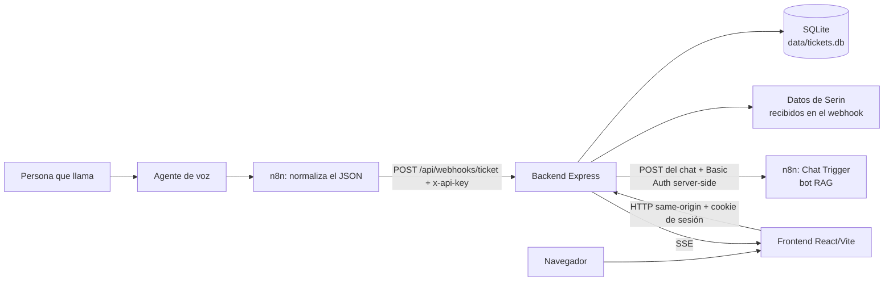

## 2. Estilo arquitectónico

### Monolito modular

El repositorio contiene varios paquetes, pero la aplicación se ejecuta como dos procesos principales:

1. El frontend, responsable de la experiencia de usuario.
2. El backend, responsable de autenticación, reglas de negocio y persistencia.

Los paquetes de `lib/` son módulos reutilizables dentro del mismo workspace; no son servicios independientes. Esta separación permite mantener límites claros sin introducir llamadas de red entre módulos internos.

### Módulos y capas del backend

El backend está organizado por funcionalidades en `backend/src/modules`. Cada módulo expone un `index.ts` como API pública y crea únicamente las capas que necesita: `http` para rutas y adaptación, `application` para casos de uso y reglas de orquestación, `data` para consultas y persistencia, y `jobs` para procesos programados. `backend/src/routes/index.ts` actúa como composition root de Express; ya no contiene las implementaciones de Tickets, Dashboard, Administración o Ingesta.

Las capacidades técnicas reutilizables viven en `backend/src/shared` —configuración, observabilidad, eventos, readiness, ciclo de vida y validaciones transversales— y no contienen reglas de un dominio. Los módulos pueden depender de esta capa y de los paquetes compartidos del workspace, mientras que `shared` no depende de módulos de negocio.

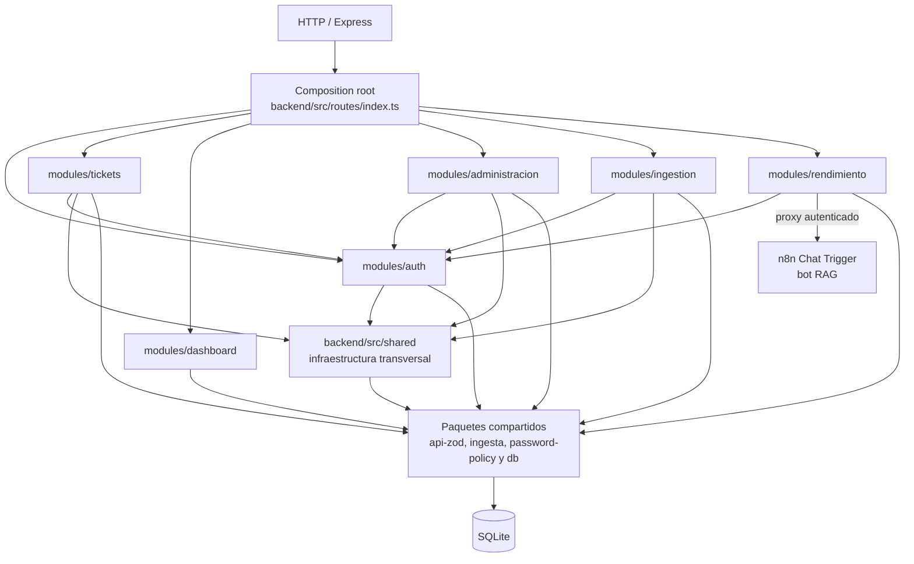

| Módulo                   | Responsabilidad actual                                                                                        |
| ------------------------ | ------------------------------------------------------------------------------------------------------------- |
| `modules/auth`           | Sesión, login, cambio de contraseña, seed, seguridad de credenciales y capacidades RBAC                       |
| `modules/tickets`        | Consulta, detalle, edición, seguimiento, auditoría, prioridad automática, orden y exportación                 |
| `modules/dashboard`      | Períodos operativos, agregaciones SQL y endpoints del resumen operativo                                       |
| `modules/administracion` | Usuarios, roles, operaciones masivas y CRUD administrativo protegido                                          |
| `modules/ingestion`      | Webhook e ingreso idempotente de datos desde n8n/Serin                                                        |
| `modules/rendimiento`    | Conjuntos analizados y agregaciones ejecutivas auditables, más el proxy protegido del asistente RAG hacia n8n |
| `backend/src/shared`     | Configuración, logging, SSE, readiness, ciclo de vida del proceso y validaciones técnicas reutilizables       |

#### Transporte y seguridad

`backend/src/index.ts` carga el entorno y valida los secretos obligatorios de arranque antes del seed y antes de abrir el puerto; una configuración requerida incompleta no puede reportarse saludable. `backend/src/app.ts` desactiva la firma `X-Powered-By` y configura logging HTTP, cookies y parseo del body. No se emiten headers CORS: React consume `/api` desde el mismo origen mediante Vite/Nginx, incluso para el chat, mientras que la ingesta desde n8n y la salida del proxy hacia el Chat Trigger son llamadas servidor-a-servidor. n8n nunca recibe la solicitud directamente desde el navegador, por lo que CORS no forma parte de esta integración. En producción, Nginx oculta su versión y la firma defensiva de Express, impide MIME sniffing y framing, limita el referrer cross-origin y deshabilita capacidades del navegador que la aplicación no usa. Estas cabeceras se declaran en `server`, con `always`, para cubrir SPA, API, SSE y respuestas de error. `backend/src/routes/index.ts` monta las rutas bajo `/api` en este orden:

El mismo composition root controla readiness y salida. El proceso comienza en `starting`, pasa a `ready` únicamente desde el evento HTTP `listening` y entra en `draining` como primera acción síncrona ante `SIGTERM`, `SIGINT` o un error del servidor. Esa transición es irreversible: una carrera entre la señal y `listening` no puede volver a publicar una instancia que ya se está apagando. Luego cancela futuras pasadas de prioridad, inicia `server.close()`, pone el registro SSE en drenaje —también rechaza altas tardías— y espera HTTP junto con el trabajo periódico ya iniciado. El controlador es idempotente frente a señales repetidas. Como un cliente abortado puede liberar su socket antes de que termine el handler async, SQLite se cierra sincrónicamente en `beforeExit`, no en el callback HTTP. El watchdog de 20 segundos queda referenciado durante el drenaje y luego pasa a `unref`: no impide la salida natural, pero fuerza sockets y código de error si otro trabajo mantiene vivo el proceso. Una vez concluidos migrador y bootstrap, Docker entrega la señal directamente a Node mediante `exec` y concede 30 segundos antes de `SIGKILL`; esa garantía todavía no cubre las fases iniciales, cuya separación queda como hardening posterior.

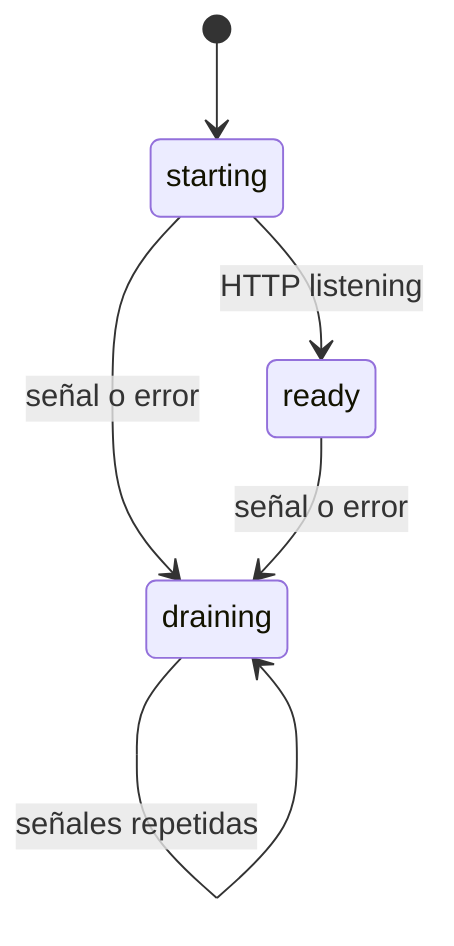

`GET /api/healthz` es liveness: responde siempre `200 { status: "ok" }` mientras el proceso pueda atender HTTP y no toca la base. `GET /api/readyz` es readiness: fuera de `ready` devuelve 503 sin ejecutar la sonda; dentro de `ready` comprueba que el handle SQLite esté abierto y prepara lecturas acotadas sobre Tickets, cuarentena y el schema completo de sesiones requerido por runtime. Un fallo se registra internamente pero la respuesta pública queda reducida a `503 { status: "unavailable" }`, sin paths, excepciones ni detalles del motor. Ambas rutas son públicas y usan `Cache-Control: no-store`.

1. `health`: liveness y readiness públicos.
2. `webhooks`: ingesta pública protegida por `x-api-key`.
3. `auth`: login y logout idempotente son públicos; sesión actual y cambio propio validan la cookie dentro del router.
4. `requireSession`: candado global para el resto de la API.
5. Tickets, dashboard, rendimiento, administración y SSE.

La API valida entrada con schemas generados desde OpenAPI/Zod. Administración exige rol SysAdmin; el prefijo completo de Rendimiento, incluido `POST /api/rendimiento/asistente/chat`, exige la capacidad reservada a SysAdmin y Controller; y Controller accede a Tickets en modo de solo lectura. Estos controles se verifican en el backend en cada request, de forma independiente del frontend.

#### Reglas de negocio

Las reglas importantes viven fuera de los handlers cuando pueden reutilizarse:

- `lib/ingesta/src/motivos.ts`: clasificación estable del motivo.
- `lib/ingesta/src/sla.ts`: 48 horas hábiles, pausando sábados y domingos.
- `lib/password-policy`: política única de credenciales nuevas para servidor y UI.
- `backend/src/modules/tickets/application`: prioridad automática, auditoría, validación de cambios y reconciliación conservadora de Embargos.
- `backend/src/modules/tickets/data`: acceso, filtros SQL, orden y serialización/streaming de CSV.
- `backend/src/modules/tickets/jobs`: ejecución al arranque y periódica de la promoción de prioridad.
- `backend/src/modules/dashboard`: períodos en la zona estable de Buenos Aires y agregaciones SQL separadas del transporte HTTP.
- `backend/src/modules/administracion`: catálogo y CRUD de usuarios/roles, operaciones masivas y restricciones administrativas.
- `backend/src/modules/auth`: capacidades RBAC, sesiones, credenciales y protecciones del login.
- `backend/src/modules/ingestion`: adaptación HTTP de la ingesta idempotente; clasificación y SLA permanecen en `@workspace/ingesta`.
- `lib/db/src/ticket-visibility.ts`: regla compartida para cuarentena de registros vacíos.

El Dashboard no carga filas completas para volver a contarlas en memoria. Sus KPIs principales se calculan con agregaciones condicionales y los motivos con `GROUP BY`; las lecturas que componen un mismo resultado se ejecutan en una transacción diferida para compartir snapshot. El conjunto analizado del período se determina por `fecha_creacion`, mientras que “nuevos hoy” y “resueltos hoy” conservan su alcance diario global. Todo límite calendario usa `America/Argentina/Buenos_Aires` y no la zona local del host.

#### Persistencia

`lib/db` crea una única conexión SQLite con:

- modo `WAL`, para mejorar concurrencia entre lecturas y escrituras;
- `foreign_keys = ON`, para respetar cascadas y restricciones;
- Drizzle ORM como acceso tipado de la aplicación;
- migraciones ejecutadas por el migrador de Drizzle en producción.

La excepción deliberada es el backup online: usa la API nativa de `better-sqlite3` para obtener un snapshot consistente aunque haya commits en WAL. El candidato aislado se normaliza a journal `DELETE`; por eso el archivo publicado es autocontenido y nunca depende de `-wal/-shm`. Antes de publicar valida integridad física, claves foráneas, identidad mínima del esquema y SHA-256; queda `0600` en POSIX, se sincroniza cuando la plataforma lo soporta y se publica con una operación no-clobber. Las pruebas cubren además que una transacción sin confirmar no ingrese al respaldo y que verificar un header WAL no cree sidecars.

La restauración es una operación de recuperación con la aplicación detenida, no parte del request path ni del rollback automático de una release. Node no puede probar de forma portable que otro proceso no tenga abierto el archivo; por eso el operador debe confirmar el outage y la primitiva agrega defensas fail-closed: lock exclusivo, identidad estable del archivo, recovery previa, checkpoint, salida temporal de WAL, ausencia de sidecars, SHA-256 y publicación atómica en el mismo directorio.

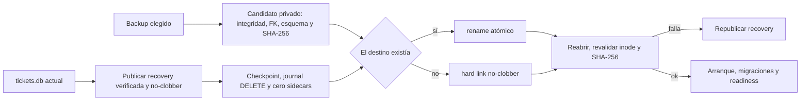

Si el destino no existía, una aparición concurrente o cualquier sidecar hace fallar la operación sin sobrescribir ni borrar ese estado ajeno. Si existía, se revalida su identidad antes de recovery, checkpoint, publicación y rollback. En POSIX se conservan usuario, grupo y modo tradicional; ACL y atributos extendidos requieren una política operativa del filesystem y no forman parte de la garantía portable de Node.

El restore nunca se ejecuta automáticamente después de un deploy fallido: podría descartar tickets o gestiones confirmadas entre el backup y el fallo. El rollback de aplicación conserva la base actual; recuperar datos desde un snapshot requiere una decisión operativa separada y trazable.

El backend es intencionalmente de instancia única respecto del archivo SQLite. Escalar horizontalmente varios contenedores contra el mismo archivo no forma parte del diseño actual.

La exportación operativa reutiliza el `WHERE` y `ORDER BY` tipados de Drizzle, pero entrega sus filas mediante un cursor incremental de `better-sqlite3`. Un `Readable` conectado por `pipeline` respeta backpressure y cierra el cursor ante desconexiones; así el consumo de memoria no crece con la cantidad total exportada. El serializador por filas conserva exactamente el formato CSV público y prepara la primera fila antes de comprometer los headers HTTP. Un deadline absoluto configurable —cinco minutos por defecto— aborta también clientes que mantengan una descarga indefinidamente lenta, evitando retener sin límite el snapshot lector y páginas antiguas del WAL.

### Frontend SPA

El frontend usa React, Wouter y TanStack Query:

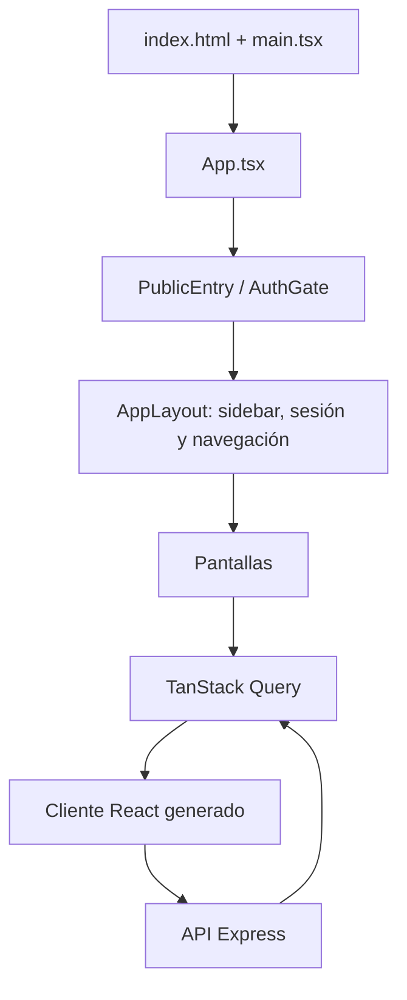

`AuthGate` evita renderizar pantallas protegidas sin una sesión válida. La raíz (`/`) es la entrada del login; cuando existe sesión, redirige a `/dashboard`.

Las pantallas principales son:

- `/dashboard`: KPIs, estados, prioridades, motivos y actividad.
- `/tickets`: listado filtrable, paginado, ordenable y exportable.
- `/tickets/:id`: detalle, edición, audio y seguimiento.
- `/rendimiento`: espacio ejecutivo visible únicamente para SysAdmin y Controller; comparte filtros y un conjunto analizado visible entre equipo, operadores, contactos recurrentes y calidad de datos.
- `/admin`: CRUD, importación, cuarentena y zona peligrosa.
- `/admin/roles-usuarios`: gestión de usuarios y roles para SysAdmin.

La pantalla de identidades administrativas se organiza como feature en `frontend/src/features/admin-directory`. La página conserva la composición de pestañas; los paneles de usuarios y roles concentran sus respectivas consultas, filtros, formularios, diálogos y mutaciones. Todas las operaciones viajan con la cookie de sesión same-origin y el backend vuelve a exigir el rol SysAdmin en cada request; no existe una segunda credencial administrativa ni estado de elevación en el navegador. Las invalidaciones por prefijo mantienen sincronizados ambos catálogos sin acoplar sus estados locales.

La administración de tickets se modulariza en `frontend/src/features/admin-tickets`. El panel de registros concentra listado, CRUD, caché optimista y resolución de conflictos; sus diálogos son hermanos de `TabsContent` para conservar estado al alternar pestañas. El importador CSV mantiene archivo, simulación y confirmación definitiva, y la zona peligrosa concentra conteo, confirmación y truncado. Las query keys describen únicamente recursos, filtros y paginación; la autorización depende de la sesión y nunca se duplica como dato de caché. `Admin.tsx` mantiene la cabecera y la composición de pestañas.

El detalle operativo se descompone en `frontend/src/features/ticket-detail`. Las tarjetas sin estado reciben por props fragmentos tipados del contrato `Ticket`; el historial es controlado y deja query, mutación y reset exitoso en la página. Consultas, editores y control optimista permanecen allí hasta que puedan trasladarse como unidades cohesionadas, sin repartir drafts ni mutaciones entre componentes.

El estado remoto se invalida después de mutaciones y también por eventos SSE. Los errores de sesión (`401`) vuelven a la entrada; los errores de servidor muestran una pantalla recuperable.

### Asistente RAG de Rendimiento

El asistente se monta únicamente en `/rendimiento`, de modo que comparte la frontera visual y RBAC de SysAdmin y Controller. La aplicación aporta el botón y el panel accesibles; `@n8n/chat` y sus estilos se importan de forma diferida recién al abrirlo por primera vez y se desmontan al abandonar la pantalla. El navegador envía cada mensaje con la cookie `gsb_session` al endpoint same-origin `POST /api/rendimiento/asistente/chat`: no conoce la URL upstream ni las credenciales de n8n.

Al abrir el chat se recupera un UUID v4 válido desde `sessionStorage["gsb_rag_chat_session_id"]` o se genera uno con `crypto.randomUUID()` —con un fallback criptográfico equivalente—. El mismo valor se reutiliza en todos los mensajes y al volver a Rendimiento dentro de esa pestaña; nunca se guarda en `localStorage`. **Nueva conversación** lo reemplaza por otro UUID v4 y remonta el widget. Un logout, un login exitoso o una transición/revocación de identidad purgan la sesión del chat, incluida la clave histórica que la librería intenta crear, y `loadPreviousSession: false` evita restaurarla.

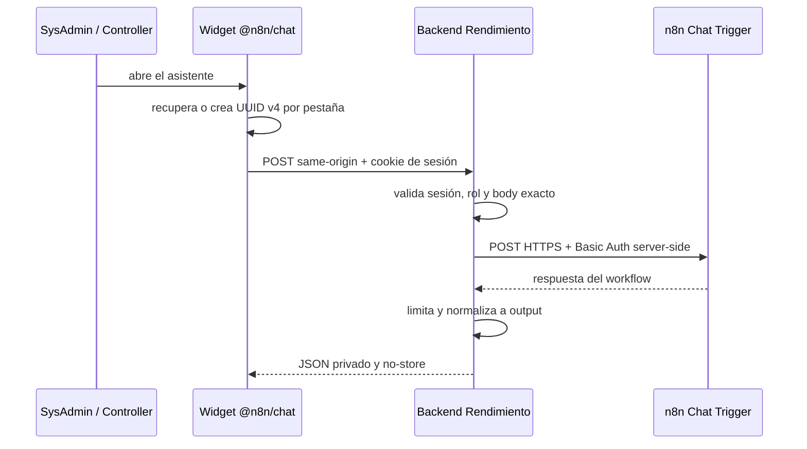

El proxy acepta únicamente el body `{ sessionId, action: "sendMessage", chatInput }`: rechaza propiedades adicionales, exige UUID v4 y limita `chatInput` no vacío a 8 KiB UTF-8. Valida que el destino sea HTTPS en producción, sin credenciales embebidas ni fragmentos, construye Basic Auth solo en memoria, no reutiliza `WEBHOOK_API_KEY` y no sigue redirects. El deadline se configura entre 1 y 120 segundos —120 segundos por defecto— y también se aborta el upstream si el cliente se desconecta.

La respuesta de n8n queda limitada a 1 MiB y se decodifica como UTF-8; el backend normaliza las formas JSON/texto soportadas a `{ output }` y rechaza respuestas vacías, malformadas o con HTML estructural. Los detalles y cuerpos de errores upstream no se reflejan al cliente. Ni el UUID, ni los mensajes, ni las respuestas se persisten en SQLite o en otro almacenamiento del backend, y el proxy no agrega PII al payload.

### Lecturas ejecutivas de Rendimiento

Rendimiento es un módulo de lectura: no persiste tablas derivadas ni modifica
tickets. Sus cuatro endpoints comparten `buildPerformanceCohortConditions`, que
define un conjunto analizado de tickets visibles por `fecha_creacion` después de aplicar
período, empresa, categoría y prioridad. Cada respuesta se calcula dentro de un
snapshot de lectura SQLite y usa un único instante `generado_en` inyectable.

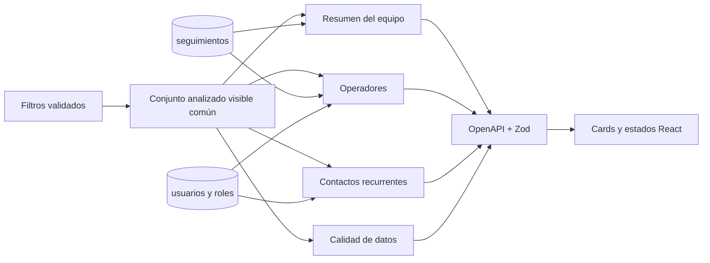

Resumen y Operadores conservan en el contrato la diferencia entre evidencia de
eventos y datos reconstruibles. Una resolución con evento se atribuye por
`autor_usuario_id`; `0021` recupera esa FK en registros anteriores solo si la
asignación estructurada y el snapshot del autor corroboran la misma identidad.
Los tickets finales que conservan `fecha_resolucion` y responsable, pero no una
transición equivalente, aportan cantidades y tiempos sin fabricar un evento.

Ambas vistas exponen dos lecturas del plazo. `cumplimiento_plazo_auditable` usa
exclusivamente transiciones no-final → final que preservaron
`fecha_limite_snapshot`. `cumplimiento_plazo` conserva esos hechos y agrega una
única última finalización reconstruible por ticket final cuando faltó el
snapshot, siempre que `fecha_creacion`, `fecha_resolucion` y `fecha_limite` sean
coherentes y la resolución no sea futura respecto de `generado_en`. En
Operadores, el responsable de esa reconstrucción es el autor de la última
resolución cuando existe o, en su ausencia, `asignado_usuario_id`. Las fuentes
y muestras permanecen separadas en la API para diagnóstico, aunque la interfaz
ejecutiva presenta el resultado combinado sin exponer jerga de implementación.

La UI deriva además un **Rendimiento operativo** por operador; no se persiste ni
forma parte del contrato HTTP. El cálculo pondera 70 % el cumplimiento total del
plazo y 30 % la proporción de abiertos asignados que todavía no están vencidos.
Si no hay abiertos, la segunda componente vale 100; si no existe muestra del
plazo, el índice queda sin valor. Con menos de cinco finalizaciones se muestra
como **Muestra inicial**. Desde cinco casos, un resultado mayor o igual a 80 se
presenta como **Favorable** y uno inferior como **Requiere atención**. Es una
señal descriptiva para orientar la revisión, no un ranking ni una decisión
automática sobre la persona; los valores base permanecen visibles para poder
interpretarla.

El Resumen del equipo calcula cuatro indicadores sobre ese mismo snapshot:

| Indicador                    | Numerador / valor                                                                                                     | Denominador / muestra                                                                                |
| ---------------------------- | --------------------------------------------------------------------------------------------------------------------- | ---------------------------------------------------------------------------------------------------- |
| Cumplimiento total del plazo | Finalizaciones antes o exactamente en su vencimiento preservado o, para el tramo legacy, en `fecha_limite` persistida | Eventos no-final → final con snapshot más una última finalización histórica reconstruible por ticket |
| Backlog vencido              | Abiertos con `fecha_limite < generado_en`                                                                             | Todos los tickets actualmente abiertos del conjunto analizado                                        |
| Antigüedad mediana           | Mediana exacta de horas hábiles entre `fecha_creacion` y `generado_en`                                                | Abiertos con fecha de creación no futura                                                             |
| Cobertura de asignación      | Abiertos con `asignado_usuario_id`                                                                                    | Todos los tickets actualmente abiertos del conjunto analizado                                        |

`abierto` equivale a un estado distinto de `resuelto` y `cerrado`. La cobertura
de asignación no utiliza `asignado_a`, porque ese texto solo conserva una
representación histórica. El backlog vencido informa además cuántos abiertos
poseen `fecha_limite`, de modo que la cobertura del plazo no quede implícita.
Cuando un denominador o muestra vale cero, el contrato devuelve `null` en lugar
de fabricar un 0 % o una mediana. El contrato conserva
`cumplimiento_plazo_auditable` para la evidencia estricta y agrega
`cumplimiento_plazo` para el total visible, con contadores separados por fuente.
La reconstrucción legacy usa valores persistidos actuales, puede cambiar si se
editan y no recupera ciclos antiguos que ya no están representados en el ticket;
por eso nunca se etiqueta como evidencia auditable.

Las horas hábiles reutilizan `@workspace/ingesta`: se cuentan las 24 horas de
lunes a viernes en `America/Argentina/Buenos_Aires`, se omiten sábados y
domingos y actualmente no se descuentan feriados. La agregación principal y la
selección de una o dos fechas centrales para la mediana se ejecutan dentro de
la misma transacción de lectura. Así comparten `generado_en` y snapshot SQLite,
sin materializar todo el backlog en Node.js. El índice por `fecha_creacion`
resuelve el rango y el orden central; la exclusión de cuarentena consulta su PK.

Los filtros temporales delimitan por fecha de creación, no reconstruyen el
estado a una fecha pasada. Por ejemplo, “mes actual” muestra la situación de
hoy de los tickets creados durante ese mes y excluye backlog más antiguo; para
una lectura global debe elegirse **Período completo**. Empresa, categoría y
prioridad también describen sus valores actuales dentro del conjunto analizado.

Contactos recurrentes asignan exactamente una clave canónica por ticket, con precedencia
DNI, teléfono y email. Una identidad secundaria sin DNI solo hereda uno cuando
la asociación directa en el conjunto analizado es unívoca. Se rechazan formatos inválidos,
secuencias numéricas repetidas y valores centinela como “sin correo”; no se
calculan componentes conexos ni se encadenan coincidencias, porque eso podría
fusionar personas por un dato compartido o incorrecto. Solo se publican grupos
con dos tickets o más y al menos uno abierto; el identificador completo nunca
sale de la capa de datos, la API entrega una máscara y un `grupo_id` opaco.

La consulta usa dos lecturas fijas dentro del mismo snapshot SQLite. Materializa
el conjunto analizado y su clave canónica una vez por lectura, calcula cobertura y totales
globales y recién entonces aplica el orden de riesgo con `row_number()`. La API
entrega como máximo 50 grupos por página y no materializa en Node.js los grupos
de otras páginas. Por tanto, el resultado es una señal acotada para revisión
operativa y no una identidad civil inferida.

La presentación mantiene tres contactos visibles inicialmente. Cada encabezado
resume nombre de referencia, coincidencia enmascarada, llamados, abiertos,
vencidos, prioridad, último contacto y responsable actual. **Ver detalles**
expone fechas, antigüedad, distribución de responsables y tickets relacionados;
la lista completa de contactos se despliega dentro de un contenedor de 680 px
como máximo con scroll propio. El paginado server-side continúa delimitando la
respuesta y cada contacto conserva un control independiente para ampliar sus
tickets más allá de los tres primeros.

## 3. Contrato y paquetes compartidos

El flujo es **contract-first**:

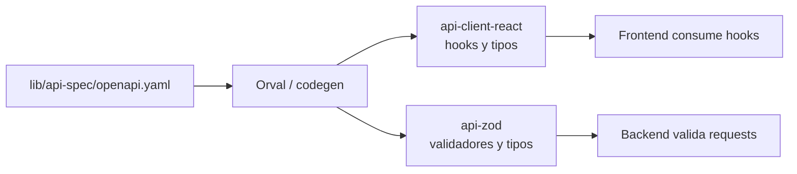

La fuente editable es `lib/api-spec/openapi.yaml`. Los archivos en `lib/api-client-react/src/generated/` y `lib/api-zod/src/generated/` son artefactos derivados: no deben editarse manualmente.

El comando oficial para regenerarlos es:

```text
pnpm run codegen
```

Otros paquetes compartidos:

| Paquete                       | Responsabilidad                                                               |
| ----------------------------- | ----------------------------------------------------------------------------- |
| `@workspace/db`               | Schema Drizzle, conexión SQLite, migraciones y visibilidad de tickets         |
| `@workspace/ingesta`          | Motivos, categorías, SLA, prioridad y origen Serin                            |
| `@workspace/api-spec`         | OpenAPI y configuración de Orval                                              |
| `@workspace/api-client-react` | Hooks React Query y tipos de consumo                                          |
| `@workspace/api-zod`          | Schemas Zod consumidos por el backend                                         |
| `@workspace/password-policy`  | Límites y reglas puras de contraseñas nuevas compartidas por backend/frontend |
| `@workspace/scripts`          | Importador histórico y backup de SQLite                                       |

## 4. Flujo de una llamada

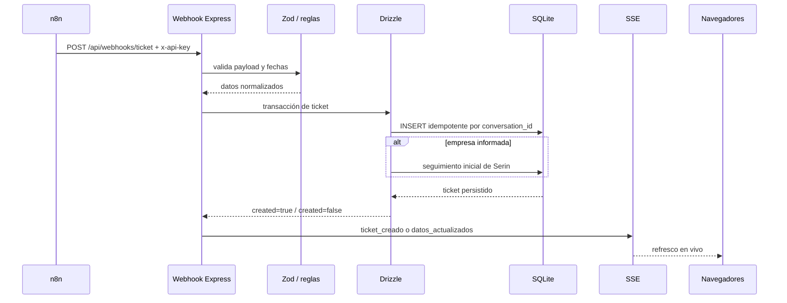

El webhook es idempotente: un reintento con el mismo `conversation_id` devuelve el ticket existente y no duplica el seguimiento inicial de Serin.

## 5. Modelo de datos

La base contiene cinco tablas de dominio y una proyección interna de cuarentena. Las fechas se almacenan como timestamp Unix en milisegundos; Drizzle las expone como `Date`.

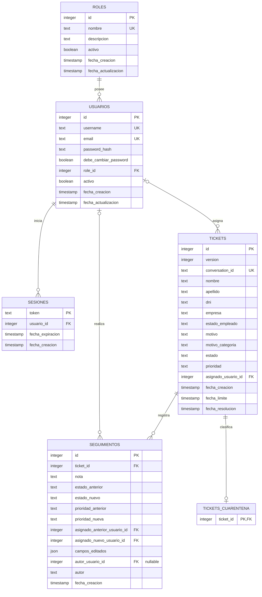

### `tickets`

Es la entidad operativa principal:

- `conversation_id` es único y funciona como clave de idempotencia de n8n.
- `version` comienza en 1, no admite cero o negativos y avanza con cada modificación real de la fila. Es metadato interno de concurrencia: no se importa ni exporta como dato de negocio.
- `motivo` y `resumen` conservan el texto recibido.
- `motivo_categoria` es una columna derivada de `motivo`/`resumen` mediante reglas deterministas. El catálogo de 14 códigos, el criterio de cada uno y el orden de precedencia están documentados en [docs/FLUJO.md](FLUJO.md#4-categorías-de-motivo). El texto original nunca se reescribe.
- `estado_empleado` admite `Activo` o `Inactivo` cuando existe una empresa asociada y proviene del dato recibido desde Serin.
- `estado` nace en `nuevo` y puede pasar a cualquier otro estado; una vez
  trabajado no puede regresar a `nuevo`. `resuelto` y `cerrado` son finales,
  pero ambos se pueden reabrir hacia `en_proceso` o `pendiente`.
- `progreso` se deriva del estado (`0`, `25`, `50`, `75` o `100`) y no es una
  decisión independiente del cliente.
- `prioridad` admite `baja`, `media`, `alta` y `urgente`; el runner puede promoverla, pero nunca degradarla automáticamente.
- `asignado_usuario_id` es la identidad autoritativa. `asignado_a` conserva un snapshot legible y compatibilidad con datos históricos.
- `fecha_limite` representa el vencimiento SLA; `fecha_resolucion` se completa al resolver/cerrar y se limpia al reabrir.

Los registros completamente vacíos permanecen almacenados para auditoría, pero se excluyen de Tickets y Dashboard mediante una condición AND. SysAdmin puede abrirlos desde Administración.

### `tickets_cuarentena`

Es una proyección interna uno-a-cero-o-uno: la presencia del `ticket_id` indica cuarentena. `0014` hace el backfill histórico y triggers de SQLite recalculan la pertenencia dentro de la misma transacción cuando cambia un campo funcional o un seguimiento. La clave primaria permite que listados y agregaciones consulten pertenencia sin reevaluar toda la regla ni recorrer el historial; el `ON DELETE CASCADE` impide marcadores huérfanos. El ticket sigue siendo la única fuente de verdad y la regla pura compartida conserva la clasificación previa a la escritura.

### `seguimientos`

Es la auditoría temporal del ticket. Registra notas manuales, alta automática desde Serin, transiciones de estado, cambios de prioridad, reasignaciones y campos editados. La asignación guarda tanto IDs como snapshots legibles para que el historial siga siendo entendible aunque un usuario sea desactivado o eliminado.

`autor_usuario_id` es una FK nullable a `usuarios.id` con `ON DELETE SET NULL`. Las acciones humanas nuevas guardan allí la identidad autenticada; los eventos automáticos permanecen en `null`. `0021` completa resoluciones históricas cuando la última asignación estructurada hasta el evento y `autor` coinciden con el mismo usuario; los casos sin doble evidencia no se modifican. La columna `autor` conserva el snapshot legible y el índice `(autor_usuario_id, fecha_creacion, id)` permite recuperar actividad atribuida con un orden estable. Las cuentas referenciadas por autoría, asignaciones o tickets históricos deben desactivarse: el borrado físico se bloquea para no aplicar `SET NULL` sobre la evidencia.

`campos_editados` contiene únicamente nombres de campos, no una copia de valores sensibles.

Las lecturas cronológicas se apoyan en índices con el ID como desempate estable. `0015` agrega índices por creación, vencimiento y resolución de tickets, y por creación global de seguimientos. Su inclusión está respaldada por `EXPLAIN QUERY PLAN` sobre las consultas reales de actividad, vencidos y conteos diarios; no se crean índices para búsquedas o expresiones que SQLite no pueda aprovechar.

### `roles`, `usuarios` y `sesiones`

- `roles` define el catálogo de perfiles. Los nombres base `SysAdmin`, `Controller`, `Administrador` y `Operador` son identidades reservadas y activas; los perfiles personalizados sí admiten ciclo de vida propio.
- `usuarios` contiene identidad, credenciales hash, rol, estado activo y el flag autoritativo `debe_cambiar_password`.
- `sesiones` persiste el usuario, expiración absoluta y únicamente un hash versionado `sha256:<64 hex>` del bearer de `gsb_session`; permite revocar sesiones y sobrevivir reinicios sin guardar en SQLite una cookie reutilizable. El borde HTTP solo acepta el raw aleatorio emitido (64 hex), deriva el hash con separación de dominio, centraliza `HttpOnly`/`SameSite=Lax`/`Path=/`, elimina cookies malformadas, vencidas o revocadas y marca `/auth/*` como `no-store`. El hash almacenado no cumple el formato de cookie y el instante exacto de expiración ya no es válido.
- `password_hash` usa scrypt asíncrono y versionado (`scrypt$v1$N$r$p$salt$hash`); nunca se almacena la contraseña en texto plano. El lector mantiene compatibilidad con el formato legado y lo rehashea con una sal nueva tras un login válido.
- Alta, reset y bootstrap validan con `@workspace/password-policy`: 8–128 unidades UTF-16, sin controles C0/DEL, whitespace exterior, placeholders públicos conocidos ni un único carácter repetido. OpenAPI reutiliza un único schema `NewPassword`; el paquete completa la blocklist contextual acotada. Se permiten frases con espacios interiores y no se recorta ni normaliza el secreto antes de hashearlo (NFKC/minúsculas se usan solo para comparar la blocklist y el patrón repetitivo).
- Login acepta 1–128 unidades UTF-16 para preservar credenciales históricas y poder migrar su hash; esa compatibilidad no habilita nuevas claves fuera de política.
- La protección anti-fuerza-bruta no forma parte del modelo persistente: mantiene en memoria hasta 20.000 hashes de identidades, con ventana deslizante de diez fallos confirmados/15 minutos y bloqueo de 15 minutos. Una compuerta separada combina un token bucket con ráfaga inicial de 30 KDF y reposición de 30 por minuto, cuatro activos y ocho en cola.
- Alta, reset administrativo y bootstrap dejan la credencial como temporal. Un usuario en ese estado conserva únicamente sesión actual, logout y cambio propio; el segundo guard global bloquea tickets, dashboard, administración y SSE hasta que el flag sea exactamente `false`.
- El cambio propio usa comparación optimista del hash y una transacción para actualizar hash/flag, revocar todos los tokens y crear la nueva sesión. La migración deja a usuarios históricos en `false`, pero el schema usa `DEFAULT true` y `CHECK (0,1)` para que futuras omisiones fallen de forma segura.

Invariantes de RBAC aplicadas en backend y reflejadas en la UI:

- un rol inactivo no permite login ni nuevas asignaciones; al desactivarlo se revocan atómicamente las sesiones de sus usuarios y, después del commit, cada stream recibe el evento terminal `sesion_revocada` antes de cerrarse;
- un cambio real de `usuarios.role_id`, la desactivación de la cuenta o el reset administrativo de contraseña aplican la misma revocación y notificación; reenviar el mismo rol es un no-op para la sesión;
- el cambio propio de contraseña cierra los streams anteriores sin el evento terminal: en ese flujo se entrega una cookie rotada válida y el navegador debe poder reconectar con ella;
- los cuatro roles base no se renombran, desactivan ni eliminan;
- una actualización de usuarios no puede dejar el sistema sin al menos un SysAdmin activo, con username y hash scrypt utilizable;
- el seed crea/reactiva roles canónicos y migra solo la identidad histórica: nunca convierte en masa el rol `Administrador` en `SysAdmin`.

## 6. Seguridad y autorización

Antes de entrar al flujo de sesión, `POST /auth/login` crea una reserva usando el hash del `username` normalizado. Solo un rechazo real de credenciales confirma el fallo; capacidad agotada, carreras administrativas y `5xx` liberan la reserva. Una desconexión no cancela trabajo criptográfico ya admitido: su resultado real confirma o libera la reserva, para que abortar solicitudes no permita eludir el límite. Existencia, activación y validez de contraseña no cambian la semántica observable: hasta diez fallos reciben el `401` genérico y la siguiente solicitud recibe `429 LOGIN_RATE_LIMITED` con la espera explícita. Un acceso correcto o una recuperación administrativa elimina el bucket. No se usa una IP obtenida de `X-Forwarded-For`, porque el backend también es alcanzable directamente en el puerto 5000 y ese header sería falsificable sin una lista exacta de proxies confiables.

El rate limit y la compuerta de scrypt son estado deliberadamente local del proceso. Esto coincide con el backend único exigido por SQLite/SSE, evita escrituras controladas por atacantes en la base operativa y mantiene una interfaz aislada para migrar a Redis u otro store si cambia la topología.

Las capacidades canónicas se resuelven en `modules/auth/domain/rbac.ts` y se aplican mediante middlewares del mismo módulo. La matriz actual es:

| Rol           | Dashboard | Tickets                                         | Rendimiento | Administración |
| ------------- | --------- | ----------------------------------------------- | ----------- | -------------- |
| SysAdmin      | Ver       | Leer, gestionar y cerrar                        | Ver         | Sí             |
| Controller    | Ver       | Solo lectura, incluido detalle, historial y CSV | Ver         | No             |
| Administrador | Ver       | Leer, gestionar y cerrar                        | No          | No             |
| Operador      | Ver       | Leer y gestionar, sin cerrar                    | No          | No             |
| Personalizado | Ver       | Leer y gestionar, sin cerrar                    | No          | No             |

Controller es un perfil directivo de solo lectura: puede consultar Dashboard, Tickets y Rendimiento, pero no modificar tickets ni acceder a Administración. `GET /api/rendimiento` está protegido en el prefijo completo del módulo para que sus futuros endpoints nazcan con la misma restricción.

El diagrama siguiente cubre las rutas funcionales posteriores al router de autenticación.

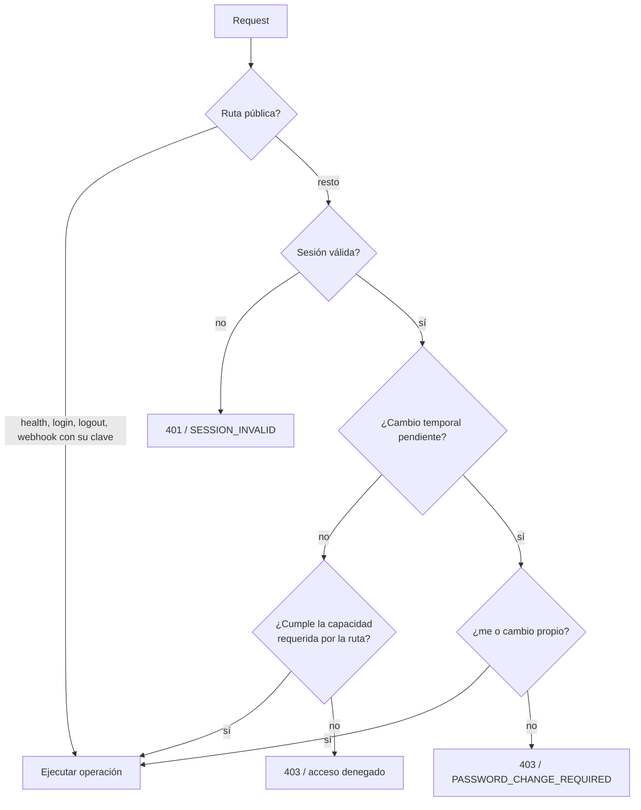

La protección se aplica en dos lugares:

1. El frontend oculta y bloquea pantallas según la sesión para mejorar la experiencia.
2. El backend vuelve a validar sesión y rol en cada operación sensible. La UI nunca es la única barrera.

Configuración y credenciales:

- `WEBHOOK_API_KEY`: autentica a n8n.
- Cookie `gsb_session`: autentica usuarios del panel.
- `BOOTSTRAP_SYSADMIN_PASSWORD`: secreto exclusivo del bootstrap para crear `sysadmin` cuando no hay hashes o rotar la credencial semilla heredada; la contraseña resultante es temporal.
- `N8N_CHAT_WEBHOOK_URL`: destino HTTPS del Chat Trigger, disponible únicamente para el backend.
- `N8N_CHAT_BASIC_AUTH_USER` y `N8N_CHAT_BASIC_AUTH_PASSWORD`: credenciales Basic Auth que el backend agrega al request saliente y que nunca llegan al bundle del navegador.
- `N8N_CHAT_TIMEOUT_MS`: deadline opcional del workflow, entre 1000 y 120000 ms y con 120000 ms por defecto.

Las API keys, las credenciales Basic Auth del chat y el secreto bootstrap se entregan por variables de entorno o secretos del runner y no deben entrar al repositorio. La configuración del chat se resuelve únicamente en el backend: si falta un valor requerido o si la URL, las credenciales o el timeout no superan sus validaciones, el endpoint devuelve indisponibilidad genérica sin filtrar el valor defectuoso. `WEBHOOK_API_KEY` se valida al arrancar: debe existir, tener al menos 32 caracteres y no usar controles, espacios exteriores, un único carácter repetido ni placeholders públicos; los errores solo identifican la variable, nunca su valor. Las credenciales crudas no se persisten en la base: del secreto bootstrap solo se guarda un hash scrypt. Una credencial ya asegurada se conserva: la variable bootstrap no funciona como mecanismo de reset. La rotación de compatibilidad actualiza el hash, activa el cambio obligatorio y revoca las sesiones del seed histórico en una única transacción.

## 7. Estados, SLA y auditoría

La regla que el código aplica es una sola: **no se vuelve a `nuevo`**. Cualquier
otro movimiento está permitido, incluidas las reaperturas de un caso resuelto o
cerrado.

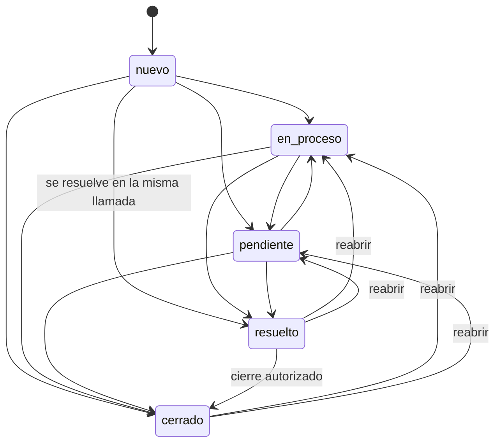

Por qué es tan permisiva: sobre el histórico de producción, `nuevo -> resuelto`
concentra 58 de los 76 cambios de estado reales, porque muchas consultas se
resuelven durante la misma llamada. Un flujo lineal obligatorio rechazaría el
uso mayoritario del equipo. Lo único que se prohíbe es retroceder a `nuevo`:
borraría la evidencia de que el ticket ya fue trabajado y falsearía las lecturas
de Rendimiento, que cuentan transiciones de un estado no-final a uno final.

La máquina vive en `lib/ingesta/src/estados.ts`
(`esTransicionDeEstadoValida`, `describirTransicionInvalida`) y se aplica en el
`PATCH /api/tickets/:id`, que es el único camino que cambia el estado. Un
intento inválido devuelve `400` con el motivo, sin escribir el ticket ni auditar.

Reglas complementarias:

- El progreso (`0`–`100`) no es un dato independiente: se deriva del estado con
  `progresoDeEstado()` e ignora lo que envíe el cliente, de modo que no puede
  existir un `resuelto` con 0%. La UI lo muestra, no lo decide.
- El primer cambio desde `nuevo` autoasigna el ticket al usuario autenticado.
- Cada cambio posterior de estado lo asigna al último usuario que lo modificó.
- A 24 horas hábiles del vencimiento, la prioridad mínima pasa a `alta`.
- A 12 horas hábiles o con vencimiento superado, pasa a `urgente`.
- Sábados y domingos no consumen horas SLA; los feriados actualmente sí cuentan.
- Ticket, asignación y seguimiento se persisten en una misma transacción cuando corresponde.
- Los editores de gestión, datos de contacto y CRUD administrativo congelan datos + `version` al abrirse y construyen PATCH mínimos con `expected_version`. El backend reserva escritura con `BEGIN IMMEDIATE`, compara la revisión antes del no-op y vuelve a condicionarla en el UPDATE. Una carrera devuelve `409 TICKET_VERSION_CONFLICT`; no aplica cambios, no audita y no emite SSE. El frontend mantiene el editor y su draft visibles, bloquea un nuevo guardado y solo reemplaza el baseline cuando la persona confirma que quiere descartar sus cambios y cargar la revisión actual. Las escrituras de caché comparan versiones y nunca degradan una revisión más nueva recibida en paralelo. En Administración, los opcionales borrados se expresan como `null`, `conversation_id` permanece inmutable y un no-op vigente no genera tráfico ni auditoría.
- Las importaciones web/CLI deduplican e insertan todas las filas válidas bajo una transacción; las corridas reales reservan escritura con `BEGIN IMMEDIATE` y un error de persistencia revierte la tanda insertable. Las filas inválidas se saltean según el contrato y `dry_run` usa un snapshot diferido sin escribir.
- El truncate elimina seguimientos y tickets y reinicia sus secuencias en una sola transacción. Los conteos usan `changes`, sin cargar todos los IDs borrados en memoria.

## 8. Tiempo real y consistencia

El backend mantiene clientes SSE en memoria. Después de confirmar una escritura en SQLite, emite eventos como `ticket_creado`, `ticket_actualizado`, `datos_actualizados` o `actividad_actualizada`.

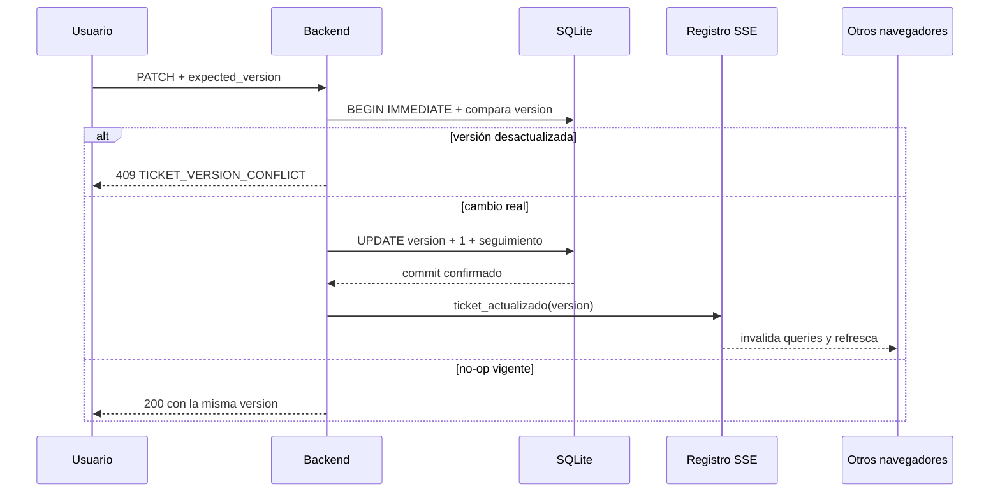

Si una auditoría falla, la transacción se revierte. Si un cliente SSE se desconecta, se elimina sin afectar la operación HTTP que ya fue confirmada. Las revocaciones administrativas se notifican únicamente después del commit con `sesion_revocada`; el frontend cierra su `EventSource`, limpia de inmediato toda la caché y reemplaza la ruta por la entrada pública. La raíz consulta `/auth/me` sin datos stale: un `401` muestra el login y un `200` de una cookie instalada en otra pestaña vuelve a montar la identidad y un stream nuevos. Un corte de red común no se interpreta como logout y conserva la reconexión automática.

### Calidad estática

El workspace usa ESLint flat con reglas de TypeScript, promesas, hooks de React y `jsx-a11y`. Las fuentes se analizan con información de tipos mediante `projectService`; tests y configuración reciben lint estructural desde sus `tsconfig` de prueba. El alcance incluye backend, frontend, scripts, librerías y `e2e/`; código generado, builds y dependencias quedan excluidos. Las expresiones regulares que procesan controles mantienen supresiones locales motivadas, no excepciones globales.

La deuda de `any` explícito quedó eliminada del alcance analizado. `no-explicit-any` es un error y `--max-warnings 0` impide aceptar advertencias. El Dashboard trata de forma explícita la nulabilidad de `fecha_limite`, aunque la consulta de vencidos la excluya en SQL. `pnpm run quality` ejecuta lint y `format:check` antes de codegen, schema, suites no-browser, typecheck y builds. En GitHub, un segundo job `e2e` depende de ese resultado, instala Chromium y ejecuta Playwright; ambos jobs son bloqueantes en el workflow Quality para pull requests. Deploy es un workflow independiente disparado desde `main`.

La suite `e2e/` usa Playwright con Desktop Chrome, un solo worker y una base SQLite efímera. Su servidor aplica dos veces la cadena real de migraciones, inicia el backend y Vite en puertos exclusivos y cubre cuatro recorridos: autenticación/cambio obligatorio, ingesta/SSE/auditoría, RBAC/revocación y cuarentena/conflicto/exportación. Una única invocación del teardown ejecuta hasta tres rondas internas: cada paso tiene deadline, los fallos no bloquean los recursos siguientes y una operación todavía activa se comparte en vez de duplicarse. Resoluciones tardías completan el paso, rechazos tardíos habilitan su reintento y los errores finales se conservan en orden. Las trazas, screenshots y videos retenidos ante fallos quedan en `e2e/artifacts/`; en CI se agrega allí el reporte HTML. GitHub publica el directorio como `playwright-diagnostics` durante 7 días cuando el job falla.

## 9. Despliegue y migraciones

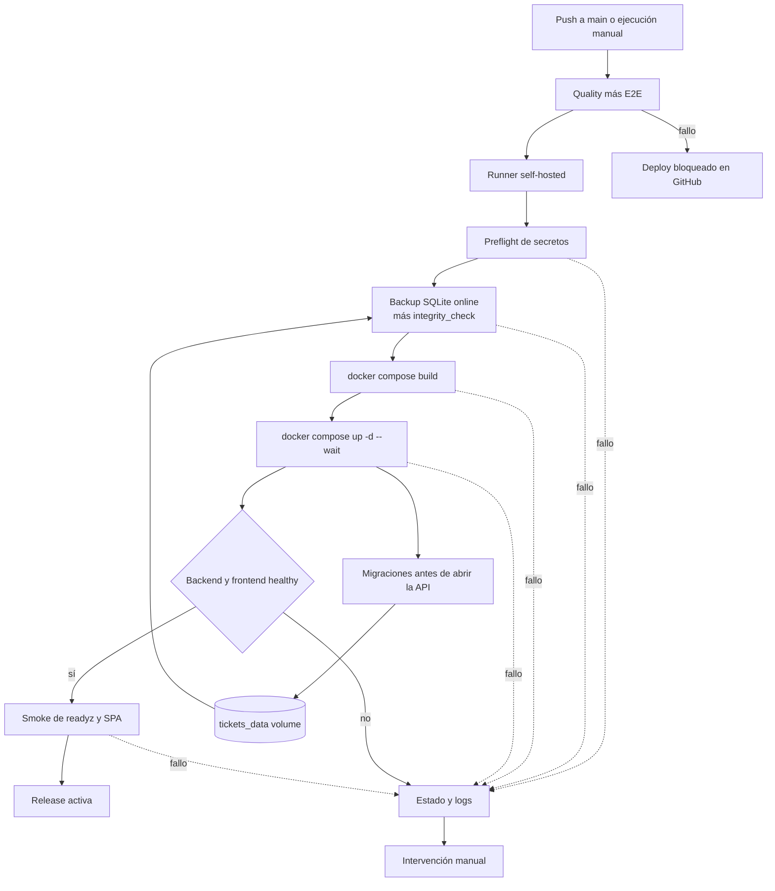

El workflow Deploy se activa ante cada push a `main` o por `workflow_dispatch`. El grupo de concurrencia `deploy-testing` serializa ejecuciones y `cancel-in-progress: false` evita interrumpir un despliegue que ya empezó. Antes de reservar el runner self-hosted, invoca el workflow reutilizable Quality: sus jobs de validación y E2E deben aprobar para habilitar el job que accede a Docker y a los datos productivos.

Antes de tocar los datos, el workflow valida que existan `WEBHOOK_API_KEY` y las tres variables requeridas del asistente n8n, sin imprimir sus valores. Después, un contenedor efímero monta `ticketsadmin_tickets_data` en solo lectura y usa la API `.backup` de SQLite. La copia queda fuera del checkout en `/var/lib/ticketsadmin/backups` y debe superar `PRAGMA integrity_check`. Si no existe el volumen o `tickets.db`, se considera una instalación nueva. Un secreto ausente o un fallo real de backup detienen el job.

`docker compose build` recibe únicamente placeholders no sensibles. Los secretos se inyectan al ejecutar `docker compose up -d --wait --wait-timeout 180`. El backend aplica `dist/migrate.mjs` antes de abrir la API; su healthcheck exige el JSON exacto de `/api/readyz`. El frontend queda healthy solo si Nginx sirve la SPA y alcanza readiness a través del proxy. El host agrega dos smokes: readiness directa y HTML de la SPA.

El volumen nombrado persiste entre recreaciones. El workflow no ejecuta `compose down -v`, prune, eliminación de volumen ni restore de SQLite. Tampoco implementa rollback automático, ledger de releases o reconciliación de intentos: ante un fallo conserva los datos, publica `compose ps` y logs, y requiere una decisión manual entre corrección hacia adelante o reversión de código. Restaurar datos sigue siendo una operación offline, explícita y separada.

En local, `pnpm --filter @workspace/db run push` combina `drizzle-kit push` con una reconciliación transaccional de invariantes no expresables por el schema declarativo. Así se conservan las bases históricas sin ledger sin fingir que ejecutaron migraciones. El backend vuelve a validar tabla, FK y fingerprint de los cinco triggers antes de cualquier seed o tarea; una base versionada incompleta falla cerrada. En Docker, `dist/migrate.mjs` ejecuta la cadena real antes de iniciar la API. Las migraciones versionadas actuales mantienen una secuencia lineal:

```text
0000 ... 0006  → schema base y categorías iniciales
0007            → estado_empleado
0008            → auditoría de seguimientos de v0.5
0009            → backfill conservador de Embargos
0010            → cambio obligatorio de credenciales temporales
0011            → revocación única de bearer de sesión persistidos en claro
0012            → versión monotónica de tickets para control optimista
0013            → índice compuesto de pertenencia e historial de seguimientos
0014            → proyección materializada y transaccional de cuarentena
0015            → índices temporales medidos para lecturas operativas
0016            → elevación por sesión (retirada por 0018)
0017            → backfill de préstamos, obra social, sanciones y proveedores
0018            → retira la elevación por sesión
0019            → autor estructurado nullable e índice de actividad en seguimientos
0020            → snapshot del vencimiento en cada resolución auditable
0021            → backfill conservador de autores de resolución corroborados
```

La columna física conserva el nombre histórico `sesiones.token` para permitir un rollback estructural, pero el schema la expone como `token_hash`. Desde `0011`, toda fila nueva contiene `sha256:<digest>` y el arranque elimina formatos crudos o inválidos después de validar secretos, antes del seed y antes de abrir el puerto. La migración fuerza un único re-login; no se admite un despliegue simultáneo de binarios anteriores y posteriores a este cambio. Un rollback rápido conserva el schema e invalida las sesiones creadas por la otra versión, pero el piso soportado es `06db746`, primer commit cuyo extractor rechaza todo lo que no sea raw de 64 hex.

Cada migración nueva debe:

1. partir del schema actual;
2. tener snapshot y entrada en `_journal.json`;
3. probar una base vacía y una actualización desde producción;
4. preservar los datos existentes cuando el cambio sea aditivo;
5. ser revisada antes de hacer push a `main`.

## 10. Estructura de directorios

```text
backend/                 API Express y composition root del servidor
  src/modules/           módulos funcionales con API pública propia
    auth/                sesión, credenciales, seed y capacidades RBAC
    tickets/             consulta, gestión, auditoría, CSV y prioridad
    dashboard/           agregaciones y períodos del resumen operativo
    administracion/      usuarios, roles y operaciones administrativas
    ingestion/           webhook e ingesta idempotente
    rendimiento/         métricas ejecutivas y proxy protegido del asistente RAG
  src/shared/            infraestructura transversal sin reglas de dominio
  src/routes/            composición HTTP, health y SSE aún transversales
frontend/                SPA React, pantallas, layout y componentes
e2e/                     Playwright, servidor aislado y flujos críticos de navegador
lib/api-spec/            OpenAPI, fuente del contrato
lib/api-client-react/    cliente React Query generado
lib/api-zod/             validadores Zod generados
lib/db/                  schema Drizzle, SQLite, migraciones y visibilidad
lib/ingesta/             clasificación, SLA y normalización compartida
lib/password-policy/     política pura de contraseñas nuevas
scripts/                  importador histórico y backup de SQLite
docs/                    arquitectura, flujo, deploy y bitácora
.github/workflows/        Quality para PR y Deploy independiente desde main
data/                     base local ignorada por Git
backups/                  copias locales ignoradas por Git
tmp/                      temporales de tests y desarrollo, ignorados
e2e/artifacts/            trazas, capturas, videos y reportes ignorados
```

## 11. Decisiones y límites conocidos

- **SQLite en vez de PostgreSQL:** simplifica la operación local y el servidor de testing; el volumen actual no requiere un servicio externo.
- **SSE en vez de WebSockets:** solo necesitamos notificaciones servidor → navegador; las mutaciones siguen siendo HTTP normal.
- **OpenAPI como contrato:** evita que backend y frontend diverjan, a cambio de exigir regenerar artefactos después de cambiar el YAML. En respuestas, “nullable” no significa “opcional”: tickets y seguimientos siempre incluyen la propiedad y expresan la ausencia de valor con `null`; `TicketDetail` siempre incluye el array `seguimientos`.
- **Monolito modular en vez de microservicios:** reduce despliegues, observabilidad y puntos de fallo mientras el dominio siga siendo acotado.
- **Fronteras por linter, no por paquetes:** los módulos del backend y las features del frontend no son paquetes npm separados; son carpetas con `no-restricted-imports` configurado en `eslint.config.mjs`. Se evaluó convertir cada feature del frontend en su propio paquete y se descartó: en una SPA con Vite el bundler une todo en un build final, no hay frontera de proceso ni de despliegue entre features, y el versionado interno solo agregaría mantenimiento. `lib/*` sí son paquetes porque los consume más de un runtime.
- **La bitácora de agentes quedó congelada:** `docs/BITACORA_AGENTES.MD` acumuló 285 entradas sin que nadie las consultara. Las decisiones se registran acá, lo puntual en el mensaje del commit y las reglas operativas en los `CLAUDE.md`.
- **Una instancia backend:** es una limitación deliberada de SQLite, del registro SSE y de los contadores de login en memoria. Un reinicio limpia el rate limit; varias réplicas dividirían sus buckets. Si el volumen exige alta disponibilidad, habrá que migrar persistencia, eventos y throttling a servicios coordinados antes de escalar horizontalmente.
- **Bloqueo temporal por cuenta:** protege incluso ante rotación de IP, pero una persona que conozca el username puede provocar 15 minutos de espera. El límite corto, el mensaje uniforme y el reset administrativo reducen ese riesgo; MFA o un mecanismo de recuperación autoservicio serían la evolución para cuentas críticas.
