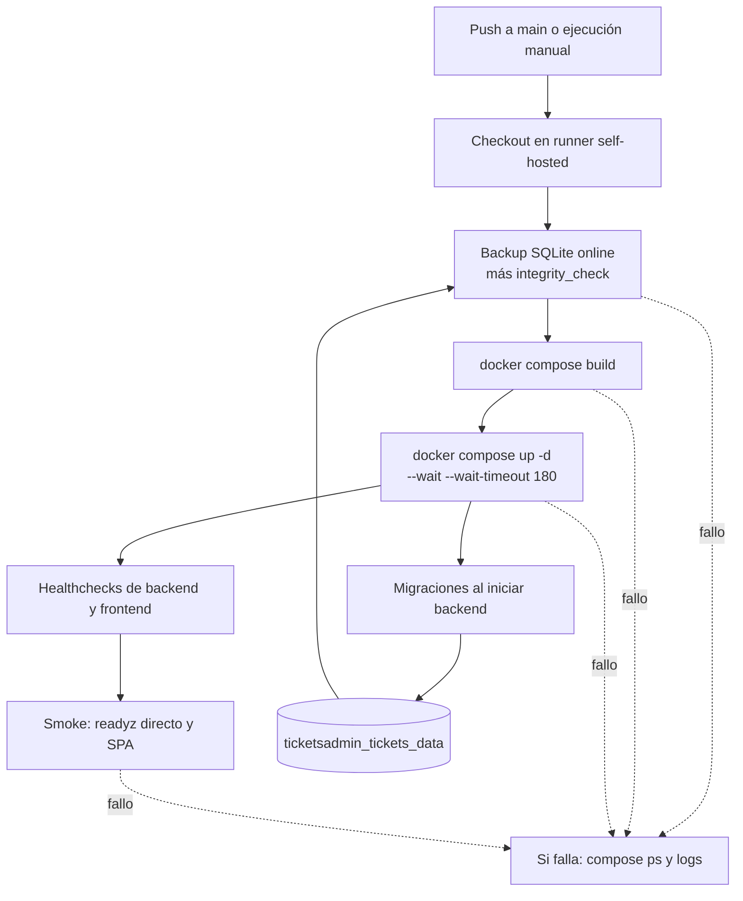

# Despliegue con Docker y GitHub Actions

Este documento describe el flujo que está activo en
[`.github/workflows/deploy.yml`](../.github/workflows/deploy.yml). Si el
workflow cambia, este runbook debe actualizarse en el mismo cambio.

## Flujo vigente



El workflow:

1. serializa los despliegues con el grupo `deploy-testing` y no cancela uno ya
   iniciado;
2. crea un backup consistente mediante la API `.backup` de SQLite y exige
   `PRAGMA integrity_check = ok` antes de continuar;
3. construye las imágenes con valores no sensibles, sin exponer secretos al
   build;
4. inyecta los secretos solamente en `docker compose up`;
5. espera hasta 180 segundos a que Compose declare saludables ambos servicios;
6. comprueba `/api/readyz` directamente en el backend y que Nginx sirva la SPA;
7. si algo falla, muestra estado y las últimas líneas de logs sin modificar los
   datos.

El volumen nombrado `ticketsadmin_tickets_data` conserva `/data/tickets.db`
entre recreaciones. El workflow no ejecuta `docker compose down -v`, no elimina
volúmenes, no hace `prune` y no restaura un backup automáticamente.

### Límites deliberados

- El deploy no tiene ledger de releases, estado `pending`, reconciliador ni
  workflow `recover-pending`.
- No hay rollback automático de la aplicación. Un fallo deja el job en rojo y
  exige inspección antes de decidir entre corregir hacia adelante o revertir
  código.
- [Quality](../.github/workflows/quality.yml) ejecuta lint, tests, typecheck,
  builds y Playwright en pull requests o por invocación explícita. El workflow
  Deploy es independiente; la protección de `main` debe exigir Quality si se
  quiere impedir que llegue código no validado.
- Si no existe el volumen o no existe `/data/tickets.db`, el workflow lo trata
  como una instalación nueva y continúa sin backup. En un servidor que ya
  debería tener datos, ese mensaje requiere detenerse y verificar el volumen.
- Compose administra una sola réplica. No ofrece cero downtime, autohealing
  continuo ni coordinación distribuida.

El antiguo ledger externo bajo `/var/lib/ticketsadmin/releases` ya no es leído
por el repositorio. Si todavía existe en el servidor, conservarlo solo como
evidencia del incidente hasta que el responsable decida archivarlo; nunca usarlo
para destrabar o dirigir un deploy actual.

## 1. Preparar el servidor

El runner necesita:

- Linux, Git y `curl`;
- Docker Engine y Docker Compose con soporte para `up --wait` y
  `--wait-timeout`;
- acceso del usuario del runner al daemon de Docker;
- salida de red para descargar imágenes y para que el contenedor Alpine instale
  el CLI de SQLite durante el backup;
- puertos TCP `3000` y `5000` disponibles.

Verificar los puertos antes del primer despliegue:

```bash
sudo ss -tlnp | grep -E ':(3000|5000)\b' || true
docker version
docker compose version
docker compose up --help | grep -E -- '--wait|--wait-timeout'
```

### 1.1. Directorio privado de backups

El workflow escribe fuera del checkout para que una actualización del repo no
borre los respaldos:

```bash
RUNNER_USER="<usuario-del-runner>"
RUNNER_GROUP="$(id -gn "$RUNNER_USER")"
sudo install -d -m 0700 -o "$RUNNER_USER" -g "$RUNNER_GROUP" \
  /var/lib/ticketsadmin/backups
```

Los `.db` contienen datos personales y hashes de autenticación. Definir
retención, copia externa y acceso restringido; no moverlos al checkout ni
commitearlos.

### 1.2. Runner self-hosted

Registrar un runner dedicado al repositorio siguiendo la instrucción que GitHub
muestra en **Settings → Actions → Runners → New self-hosted runner**. Instalarlo
como servicio con el usuario que posee el directorio de backups y comprobarlo:

```bash
cd "$HOME/actions-runner-ticketsAdmin"
sudo ./svc.sh install
sudo ./svc.sh start
sudo ./svc.sh status
```

No compartir este runner con repositorios no confiables: un job self-hosted con
acceso a Docker puede controlar contenedores y volúmenes del host.

## 2. Configurar secretos

En **Settings → Secrets and variables → Actions** definir:

| Secreto                       | Uso                                                  |
| ----------------------------- | ---------------------------------------------------- |
| `WEBHOOK_API_KEY`             | Autentica el webhook de n8n.                         |
| `ADMIN_API_KEY`               | Eleva temporalmente una sesión SysAdmin.             |
| `BOOTSTRAP_SYSADMIN_PASSWORD` | Inicialización o compatibilidad del usuario semilla. |

Las dos API keys deben ser diferentes, tener al menos 32 caracteres y respetar
la validación del backend. El valor de bootstrap puede quedar vacío solamente si
la base ya contiene credenciales válidas y el arranque no lo requiere.

Para operaciones manuales que crean o recrean contenedores, guardar los valores
en un archivo privado fuera del repo:

```bash
sudo install -m 0600 /dev/null /etc/ticketsadmin/compose.env
sudoedit /etc/ticketsadmin/compose.env
```

Contenido esperado:

```dotenv
WEBHOOK_API_KEY=<valor-real>
ADMIN_API_KEY=<valor-real>
BOOTSTRAP_SYSADMIN_PASSWORD=<valor-si-corresponde>
TZ=America/Argentina/Buenos_Aires
```

No usar placeholders con `up`, `create` o cualquier comando que pueda iniciar el
backend.

## 3. Ejecutar y verificar un deploy

Un push a `main` dispara Deploy directamente. También puede iniciarse desde
**Actions → Deploy → Run workflow**.

Al finalizar, comprobar desde el servidor:

```bash
COMPOSE_ENV=/etc/ticketsadmin/compose.env
docker compose --env-file "$COMPOSE_ENV" ps
test "$(curl -fsS --max-time 10 http://127.0.0.1:5000/api/readyz)" = \
  '{"status":"ready"}'
curl -fsS --max-time 10 http://127.0.0.1:3000/ | \
  grep -Fq '<div id="root"></div>'
test "$(curl -fsS --max-time 10 http://127.0.0.1:3000/api/readyz)" = \
  '{"status":"ready"}'
```

Los dos primeros checks reproducen el smoke automático. El tercero agrega una
verificación manual del proxy Nginx → backend.

Las migraciones de `lib/db/drizzle/*.sql` se ejecutan en orden antes de que la
API escuche. Si cambia `lib/db/src/schema`, generar y revisar la migración antes
de integrar el cambio:

```bash
pnpm --filter @workspace/db exec drizzle-kit generate --config ./drizzle.config.ts
```

## 4. Operación cotidiana

```bash
COMPOSE_ENV=/etc/ticketsadmin/compose.env
docker compose --env-file "$COMPOSE_ENV" ps
docker compose --env-file "$COMPOSE_ENV" logs --tail=150 backend frontend
docker volume inspect ticketsadmin_tickets_data
```

El backup automático queda en
`/var/lib/ticketsadmin/backups/pre-deploy-<UTC>.db`. Se crea antes del build y
se valida físicamente, pero no representa por sí solo una política de retención
ni prueba compatibilidad semántica con cualquier versión futura del código.

### Backup manual verificado

La imagen del backend incluye CLIs independientes de backup y verificación. La
copia online incluye transacciones confirmadas que todavía estén en WAL:

```bash
set -euo pipefail
umask 077
COMPOSE_ENV=/etc/ticketsadmin/compose.env
BACKUP_DIR=/var/lib/ticketsadmin/backups
BACKUP_NAME="tickets-$(date -u +%Y%m%dT%H%M%SZ).db"
EVIDENCE_NAME="$BACKUP_NAME.evidence.json"

docker compose --env-file "$COMPOSE_ENV" exec -T backend \
  node dist/backup-db.mjs --output "/tmp/$BACKUP_NAME" --json \
  > "$BACKUP_DIR/$EVIDENCE_NAME"
docker compose --env-file "$COMPOSE_ENV" cp \
  "backend:/tmp/$BACKUP_NAME" "$BACKUP_DIR/$BACKUP_NAME"
BACKEND_CONTAINER_ID="$(docker compose --env-file "$COMPOSE_ENV" ps -q backend)"
BACKEND_IMAGE_ID="$(docker inspect --format '{{.Image}}' "$BACKEND_CONTAINER_ID")"
docker run --rm --network none --read-only \
  --tmpfs /tmp:rw,noexec,nosuid,size=64m \
  --volume "$BACKUP_DIR:/evidence:ro" \
  "$BACKEND_IMAGE_ID" node dist/verify-db.mjs \
  --source "/evidence/$BACKUP_NAME" \
  --expect-evidence "/evidence/$EVIDENCE_NAME" --json
docker compose --env-file "$COMPOSE_ENV" exec -T backend \
  rm -f "/tmp/$BACKUP_NAME"
```

Cualquier salida no exitosa invalida ese backup o su evidencia. No copiar el
archivo `tickets.db` directamente mientras el backend está activo.

## 5. Respuesta ante un deploy fallido

1. No lanzar pushes, reruns ni workflows de recuperación en cadena.
2. Leer el primer error del job y los diagnósticos de `compose ps` y logs.
3. Comprobar si la versión anterior sigue sana o si Compose ya recreó uno de los
   servicios.
4. Verificar el volumen y el backup predeploy antes de cualquier intervención.
5. Elegir explícitamente entre una corrección hacia adelante o `git revert` más
   un nuevo deploy. Revertir código no revierte migraciones ya aplicadas.
6. Restaurar datos únicamente si se comprobó corrupción o se aceptó de forma
   consciente perder todo lo posterior al backup.

Nunca usar `docker compose down -v`, `docker volume rm`, copiar la base local
sobre producción ni restaurar SQLite como respuesta automática a un fallo de la
aplicación.

## 6. Restauración manual de SQLite

La restauración es una intervención offline y distinta del rollback de código.
Debe existir una decisión humana sobre el punto de restauración y la pérdida de
datos posterior.

Precondiciones:

1. Pausar la ingesta de n8n y avisar la ventana de mantenimiento.
2. **Deshabilitar primero el workflow** Deploy en GitHub Actions.
3. Detener el runner dedicado con el primer bloque de comandos.
4. Verificar el backup y confirmar que el código desplegado entiende su esquema.
5. Conservar una recovery del estado actual; no borrar archivos hasta validar la
   aplicación completa.

```bash
set -euo pipefail
umask 077

TICKETSADMIN_RUNNER_DIR="$HOME/actions-runner-ticketsAdmin"
RUNNER_SERVICE="$(sudo cat "$TICKETSADMIN_RUNNER_DIR/.service")"
sudo "$TICKETSADMIN_RUNNER_DIR/svc.sh" stop
sudo systemctl is-active --quiet "$RUNNER_SERVICE" && exit 1 || true
```

Con el servicio ya detenido, cancelar cualquier run de **Deploy** que continúe
`queued` o `in_progress`. No avanzar hasta que todos queden en estado terminal.

```bash
set -euo pipefail
umask 077

COMPOSE_ENV=/etc/ticketsadmin/compose.env
RESTORE_SOURCE=/var/lib/ticketsadmin/backups/<backup-elegido>.db
RECOVERY_DIR=/var/lib/ticketsadmin/recovery
RESTORE_STAMP="$(date -u +%Y%m%dT%H%M%SZ)"
sudo install -d -m 0700 -o "$USER" -g "$(id -gn)" "$RECOVERY_DIR"
test -f "$RESTORE_SOURCE"

BACKEND_CONTAINER_ID="$(docker compose --env-file "$COMPOSE_ENV" ps -a -q backend)"
test -n "$BACKEND_CONTAINER_ID"
BACKEND_IMAGE_ID="$(docker inspect --format '{{.Image}}' "$BACKEND_CONTAINER_ID")"
TICKETS_VOLUME_NAME="$(docker inspect --format \
  '{{range .Mounts}}{{if eq .Destination "/data"}}{{.Name}}{{end}}{{end}}' \
  "$BACKEND_CONTAINER_ID")"
test -n "$BACKEND_IMAGE_ID"
test -n "$TICKETS_VOLUME_NAME"

docker compose --env-file "$COMPOSE_ENV" stop frontend backend
VOLUME_HOLDERS="$(docker ps -q --filter "volume=$TICKETS_VOLUME_NAME")"
test -z "$VOLUME_HOLDERS"

docker run --rm --network none \
  --volume "$TICKETS_VOLUME_NAME:/data" \
  --volume "$RESTORE_SOURCE:/restore/source.db:ro" \
  --volume "$RECOVERY_DIR:/recovery" \
  "$BACKEND_IMAGE_ID" node dist/restore-db.mjs \
  --source /restore/source.db \
  --target /data/tickets.db \
  --recovery-output "/recovery/pre-restore-$RESTORE_STAMP.db" \
  --confirm-stopped

docker compose --env-file "$COMPOSE_ENV" start backend frontend
test "$(curl -fsS --max-time 10 http://127.0.0.1:5000/api/readyz)" = \
  '{"status":"ready"}'
curl -fsS --max-time 10 http://127.0.0.1:3000/ | \
  grep -Fq '<div id="root"></div>'
test "$(curl -fsS --max-time 10 http://127.0.0.1:3000/api/readyz)" = \
  '{"status":"ready"}'

sudo "$TICKETSADMIN_RUNNER_DIR/svc.sh" start
sudo systemctl is-active --quiet "$RUNNER_SERVICE"
```

Después, revisar tickets recientes, usuarios, roles, login y una gestión
completa antes de reactivar n8n y el workflow. Si `restore-db.mjs` informa un
doble fallo o deja un lock de restauración, preservar recovery, staging y lock;
no existe un `--force` seguro para ignorarlos.
